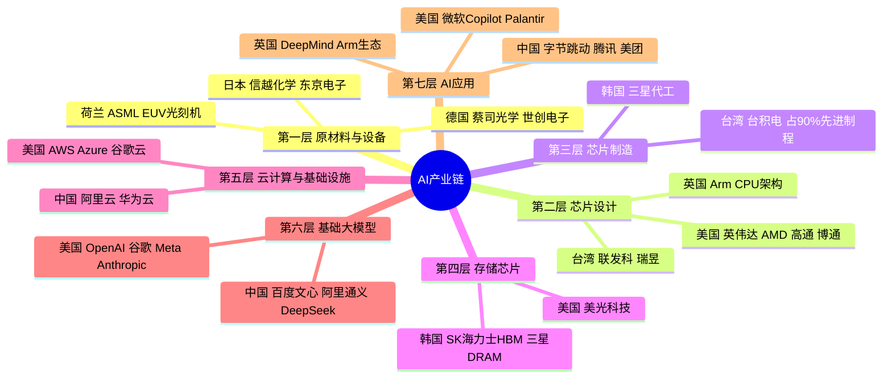

# 🌐 全球股指与AI产业链 — 导航卡（MOC）

> **内容地图** — 本库所有关于全球股指与AI产业链分工的卡片索引
> 信息来源：OECD、Nasdaq、Visual Capitalist、RBC Wealth Management、Tom's Hardware、SEMI、CNN Business（2024–2026）

---

## 📌 快速导航

| 卡片 | 主题 |
|------|------|
| [[01_AI产业链总览]] | AI产业链七层结构 + 全球分工图 |
| [[02_美国_SP500_纳斯达克]] | 🇺🇸 美国 — GPU设计、云计算、基础模型、AI应用 |
| [[03_台湾_台交所]] | 🇹🇼 台湾 — 先进制程芯片代工 |
| [[04_韩国_KOSPI]] | 🇰🇷 韩国 — HBM高带宽内存与存储 |
| [[05_日本_日经225]] | 🇯🇵 日本 — 半导体设备与材料 |
| [[06_中国_沪深300]] | 🇨🇳 中国 — AI应用层与国产硬件突围 |
| [[07_欧洲_DAX_富时_CAC]] | 🇩🇪🇬🇧🇫🇷 欧洲 — EUV光刻、CPU IP、工业AI |
| [[08_AI产业链全链路总图]] | 从硅矿到应用的完整端到端流程图 |

---

## 🗺️ AI产业链分工思维导图

---

## 📊 核心数据速览（2025–2026）

| 指标 | 数值 | 来源 |
|------|------|------|
| 标普500前10大公司权重 | **41%**（历史新高） | RBC 2026 |
| 台积电先进制程市场份额 | **>90%** | OECD 2025 |
| SK海力士HBM全球份额 | **约50%** | Sourceability 2025 |
| 英伟达AI加速器市场份额 | **约88%** | 行业数据 2024 |
| 科技七巨头2025年资本支出 | **4370亿美元** | RBC 2026 |
| 韩国KOSPI 2025年涨幅 | **+76%** | CNN Business 2026 |

---

## 🔗 相关标签
`#AI` `#半导体` `#股票指数` `#产业链` `#全球市场` `#投资研究`
