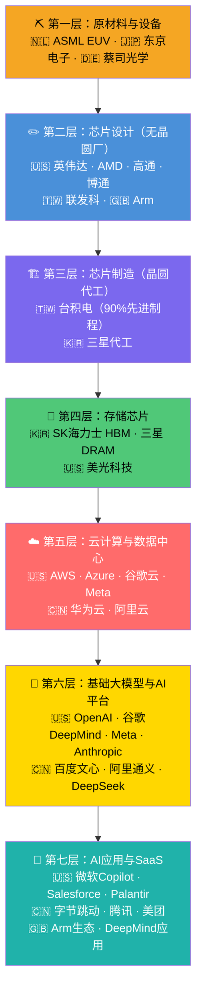
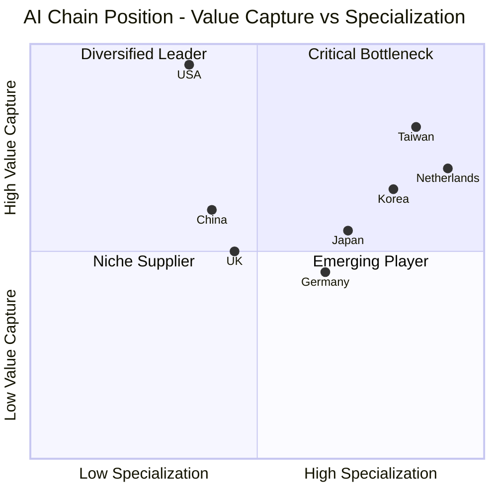
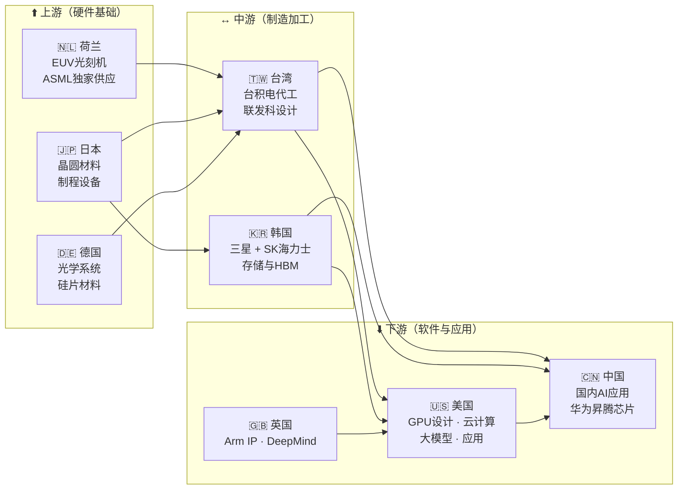

# 🏭 AI产业链总览 — 全球七层分工

> 信息来源：OECD《AI基础设施竞争》（2025）；Engenia Technologies《新全球技术栈2026》；O-Mega.ai AI技术栈报告（2026） 最后更新：2026-03

---

## AI产业链七层架构

---

## 全球分工象限图

---

## 上中下游依赖关系

---

## 全球关键瓶颈与卡脖子节点

|卡脖子节点|所在国|风险等级|
|---|---|---|
|EUV光刻机|🇳🇱 荷兰（ASML全球唯一供应商）|🔴 极高|
|先进制程代工（<3nm）|🇹🇼 台湾（台积电90%份额）|🔴 极高|
|HBM高带宽内存|🇰🇷 韩国（SK海力士约50%）|🟠 高|
|GPU芯片设计|🇺🇸 美国（英伟达约88%AI加速器）|🟠 高|
|CoWoS先进封装|🇹🇼 台湾（台积电近乎垄断）|🟠 高|
|基础大模型|🇺🇸 美国（OpenAI、谷歌、Meta）|🟡 中|
|AI应用层|🌐 分散|🟢 低|

> "亚洲仍然是全球技术栈的制造与优化引擎。台湾、韩国、中国、日本主导半导体制造、存储生产和设备组装。" — Engenia Technologies，2026

---

## 相关标签

`#AI产业链` `#半导体` `#全球分工` `#卡脖子`

## 双向链接

[[00_AI产业链导航MOC]]