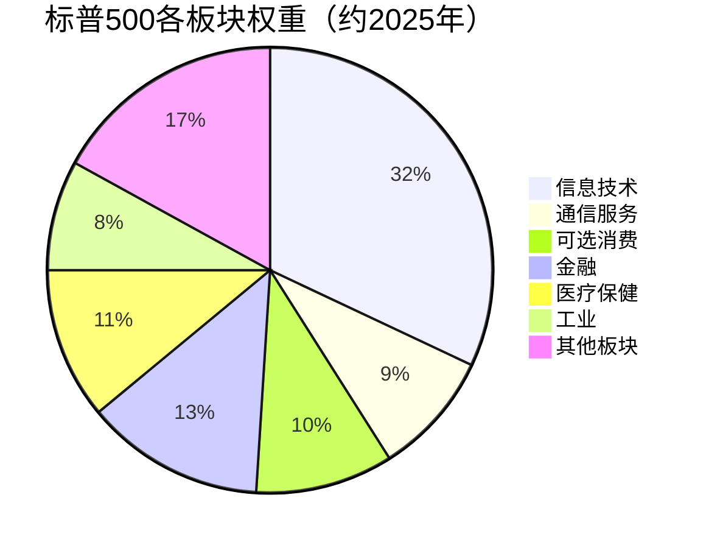
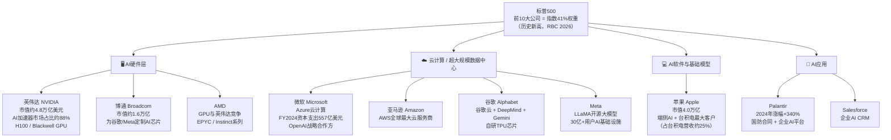
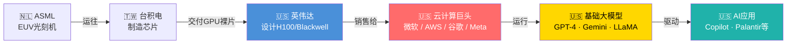

# 🇺🇸 标普500 & 纳斯达克 — 美国

> **产业链角色：** GPU芯片设计 · 云计算超大规模数据中心 · 基础大模型 · AI应用
> 信息来源：Nasdaq官网、RBC Wealth Management、Syntax Data、Fidelity、Visual Capitalist（2024–2026）

---

## 指数概览

| 指数 | 成分股数量 | 定位 |
|------|----------|------|
| **标普500（S&P 500）** | 500家公司，11个板块 | 美国大盘，按市值加权 |
| **纳斯达克综合指数** | 约3,300+家，科技为主 | 科技与成长股 |
| **纳斯达克100** | 前100家非金融公司 | 超大市值科技龙头 |

---

## 标普500板块权重（2025年）

---

## 美国AI股四层结构图

---

## 美国在AI产业链中的位置

---

## 核心数据

| 指标 | 数值 | 来源 |
|------|------|------|
| 标普500前10权重 | **40.7%**（2025年） | RBC Wealth Management |
| 英伟达市值 | **约4.8万亿美元**（2026年初） | Visual Capitalist |
| 科技七巨头2025年资本支出 | **4370亿美元** | RBC 2026 |
| 标普IT板块盈利增长（2025 Q3） | **同比+29%** | RBC/Bloomberg |
| 英伟达AI加速器市场份额 | **约88%**（2024年） | 行业数据 |

---

## 投资视角

- 美国主导产业链**第2、5、6、7层**（设计→云→模型→应用）
- **无晶圆厂芯片设计**（英伟达、AMD、博通）= 高IP价值，无制造风险
- **云计算巨头**（AWS、Azure、GCP）= AI算力租用带来持续性收入
- 集中度风险：前10大股票占标普500指数41%（RBC 2025）

---

## 相关标签
`#美国` `#标普500` `#纳斯达克` `#英伟达` `#微软` `#AI云计算` `#芯片设计`

## 双向链接
[[00_AI产业链导航MOC]] · [[01_AI产业链总览]]
