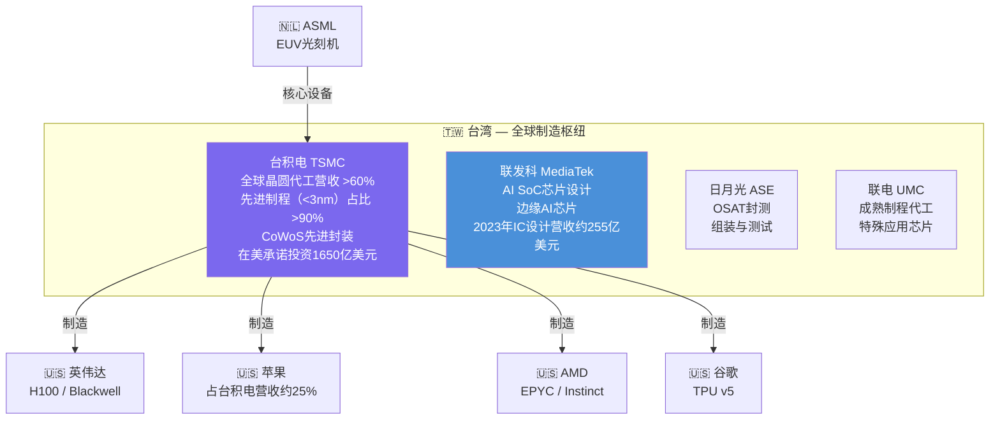
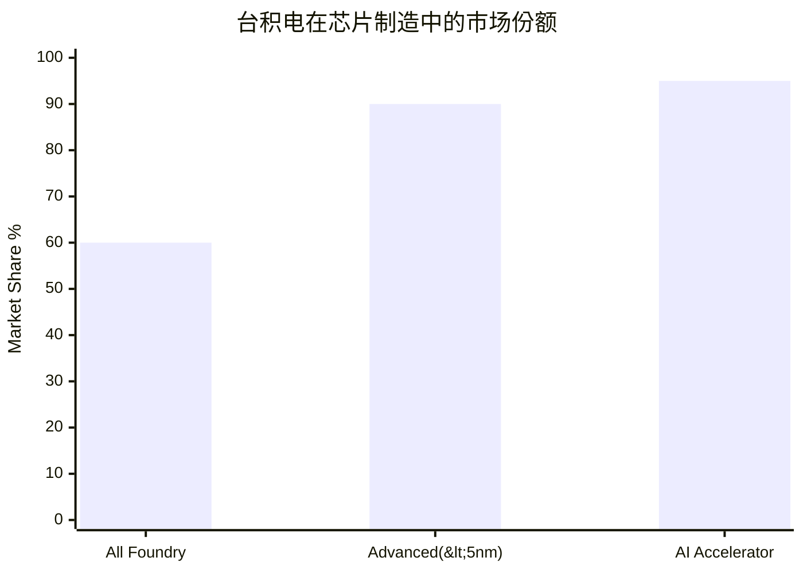
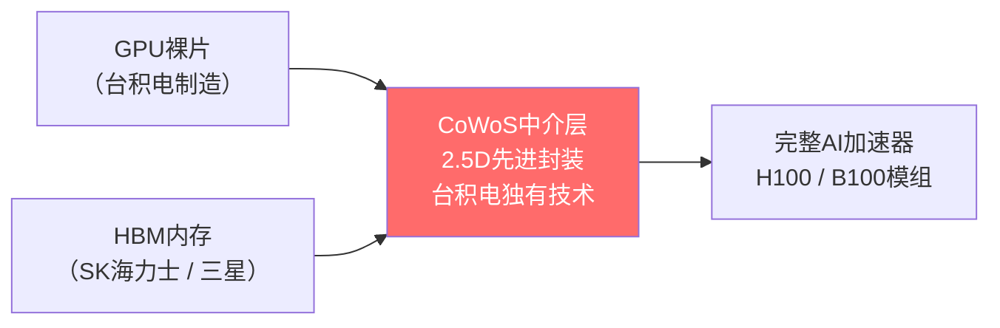
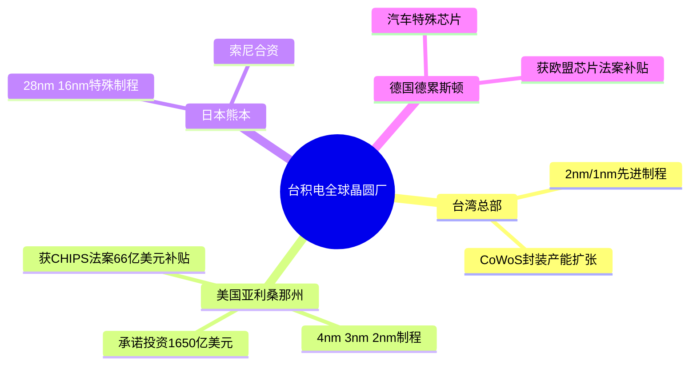

# 🇹🇼 台湾证券交易所（TAIEX）— 台湾

> **产业链角色：** 先进制程晶圆代工 · CoWoS先进封装 · IC设计 信息来源：OECD 2025、美国商务部trade.gov、Klover.ai、Tom's Hardware、Sourceability（2024–2026）

---

## 指数概览

|指数|成分股数量|核心特征|
|---|---|---|
|**台湾加权指数（TAIEX）**|约900家上市公司|半导体权重超30%|
|**台湾50（0050）**|市值前50大公司|台积电单股占指数约35%|

---

## 产业链地位：全球最关键瓶颈

---

## 台积电市场份额

> 柱图从左至右：全部代工营收份额 · 先进制程(<5nm)份额 · AI加速器芯片份额（单位：%）

---

## CoWoS先进封装 — 隐藏的第二瓶颈

> CoWoS产能严重供不应求——至2025年底订单已排满，产能目标年增速超80%（Klover.ai / Sourceability 2025）

---

## 台积电全球扩张计划（2025–2028）

---

## 主要公司与产业链层级

|公司|产业链层级|角色|
|---|---|---|
|**台积电**|第三层——制造|全球最先进晶圆代工厂|
|**联发科**|第二层——设计|手机/边缘AI SoC芯片|
|**瑞昱**|第二层——设计|AI服务器网络芯片|
|**日月光**|第三层——封测|OSAT封装与测试|
|**鸿海（富士康）**|第五层——组装|AI服务器整机组装（英伟达合作伙伴）|

---

## 核心数据

|指标|数值|来源|
|---|---|---|
|台积电代工市场份额|**>60%**（整体），**>90%**（先进制程）|OECD 2025|
|台湾半导体产业年营收|**约1650亿美元**（2024年）|trade.gov|
|占台湾GDP比例|**约20.7%**|trade.gov|
|台积电ADR（TSM）2024涨幅|**+46.54%**|CNN 2026|
|CoWoS月产能目标（2026年）|**9万片/月**|Sourceability|
|苹果占台积电营收|**约25%**|Klover.ai|

---

## 相关标签

`#台湾` `#台交所` `#台积电` `#晶圆代工` `#CoWoS` `#先进封装`

## 双向链接

[[00_AI产业链导航MOC]] · [[01_AI产业链总览]]