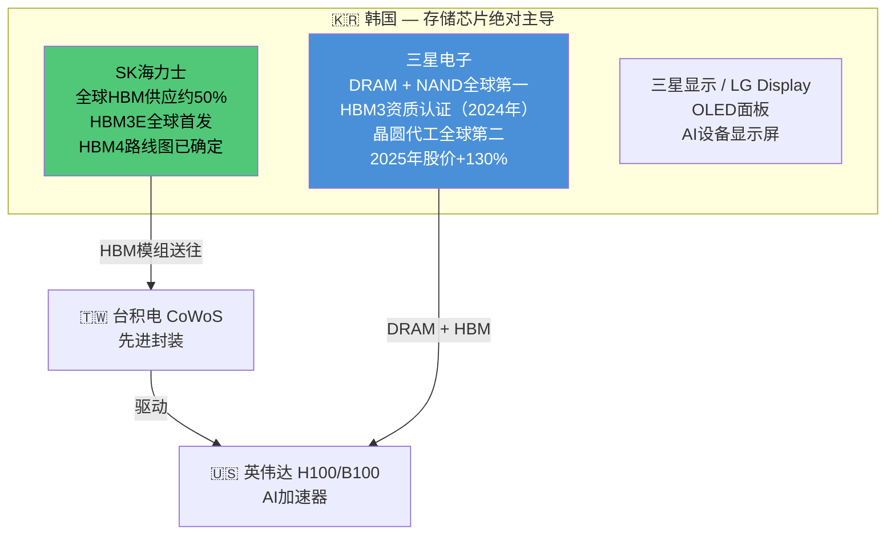
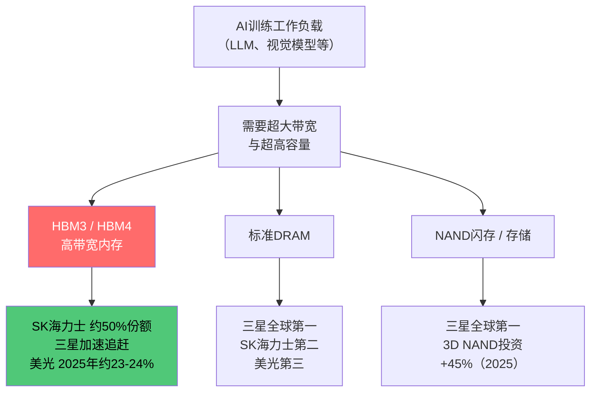
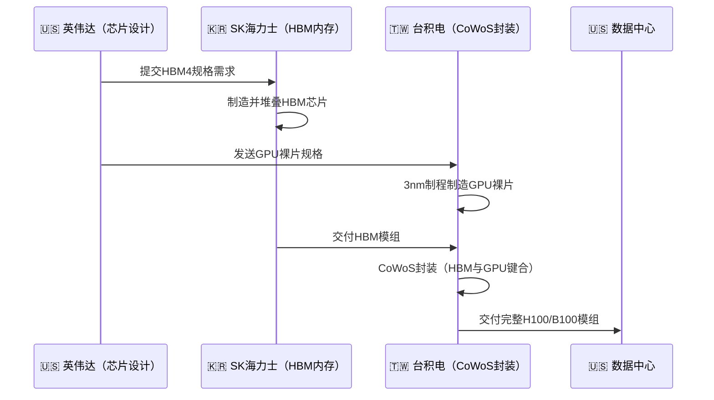

# 🇰🇷 韩国综合股价指数（KOSPI）— 韩国

> **产业链角色：** 内存芯片（DRAM/NAND）· 高带宽内存（HBM）· 显示屏 · 晶圆代工
> 信息来源：CNN Business、Sourceability、Tom's Hardware/SEMI（2024–2026）

---

## 指数概览

| 指数 | 成分股数量 | 核心板块 |
|------|----------|---------|
| **KOSPI** | 约800家大中型企业 | 半导体、显示、造船 |
| **KOSDAQ** | 约1,600家中小企业 | 科技创业、生物技术 |

**KOSPI 2025年涨幅：+76%，为1999年以来最佳年份**（CNN Business，2026年1月）

---

## 产业链地位：全球存储之王

---

## HBM在AI训练中的层级结构

---

## HBM完整供应链时序

---

## 主要公司与产业链层级

| 公司 | 产业链层级 | 角色 |
|------|----------|------|
| **SK海力士** | 第四层——存储 | HBM全球第一，约50%份额 |
| **三星电子** | 第三+四层——代工+存储 | DRAM第一、代工第二、HBM追赶中 |
| **三星显示/LG Display** | 第七层——设备显示 | AI设备OLED面板 |
| **韩美半导体** | 第三层——封装设备 | HBM热压键合机设备商 |

---

## 核心数据

| 指标 | 数值 | 来源 |
|------|------|------|
| SK海力士HBM全球份额 | **约50%** | Sourceability 2025 |
| HBM交货周期（2024-25） | **6–12个月** | Sourceability |
| HBM3价格同比涨幅 | **+20–30%** | Sourceability |
| 三星电子2025年股价涨幅 | **+130%** | CNN Business 2026 |
| KOSPI 2025年回报 | **+76%** | CNN Business 2026 |
| DRAM设备销售（2025年） | **+15.4%至225亿美元** | Tom's Hardware/SEMI |

---

## 相关标签
`#韩国` `#KOSPI` `#HBM` `#内存芯片` `#SK海力士` `#三星` `#DRAM`

## 双向链接
[[00_AI产业链导航MOC]] · [[01_AI产业链总览]]
