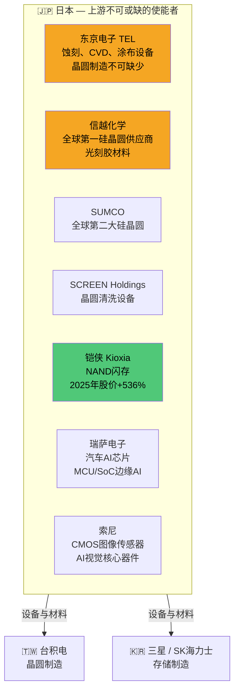
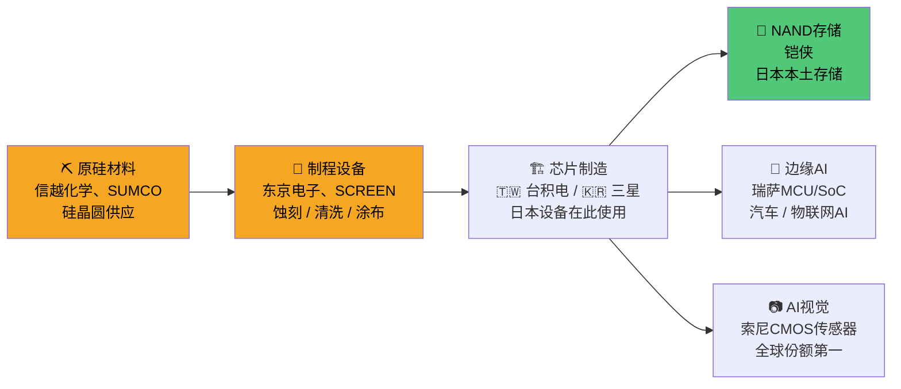
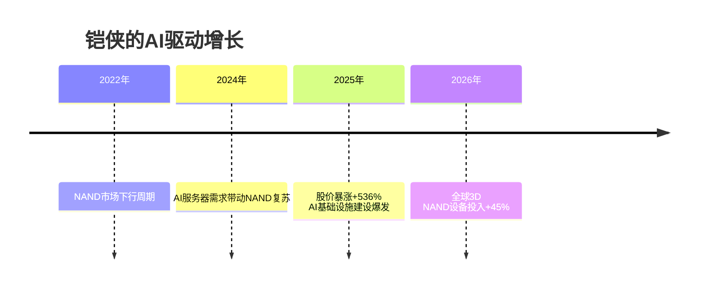

# 🇯🇵 日经225 / TOPIX — 日本

> **产业链角色：** 半导体设备 · 硅晶圆材料 · 特种化学品 · NAND闪存 · 工业机器人
> 信息来源：CNN Business、Tom's Hardware/SEMI、Visual Capitalist（2024–2026）

---

## 指数概览

| 指数 | 成分股数量 | 核心板块 |
|------|----------|---------|
| **日经225** | 225家蓝筹股 | 电子、汽车、金融 |
| **东证指数（TOPIX）** | 约2,200家公司 | 更广泛市场覆盖 |

**日经225 2025年涨幅：+26%**，半导体、芯片制造商及AI相关股拉动（CNN 2026）

---

## 产业链地位：设备与材料的关键使能方

---

## 日本在AI产业链中的定位

---

## 铠侠（Kioxia）AI驱动成长轨迹

---

## 主要公司与产业链层级

| 公司 | 产业链层级 | 角色 |
|------|----------|------|
| **东京电子（TEL）** | 第一层——设备 | 蚀刻/CVD/涂布制程设备 |
| **信越化学** | 第一层——材料 | 全球第一硅晶圆、光刻胶 |
| **SUMCO** | 第一层——材料 | 硅晶圆全球第二 |
| **SCREEN Holdings** | 第一层——设备 | 晶圆清洗系统 |
| **铠侠（Kioxia）** | 第四层——存储 | NAND闪存（与WD合资） |
| **瑞萨电子** | 第二层——设计 | 汽车/边缘AI MCU/SoC |
| **索尼** | 第二+三层——传感 | CMOS图像传感器，AI视觉核心 |
| **发那科** | 第七层——应用 | AI工业机器人 |

---

## 核心数据

| 指标 | 数值 | 来源 |
|------|------|------|
| 日经225 2025年回报 | **+26%** | CNN Business 2026 |
| 铠侠股价2025年涨幅 | **+536%** | CNN Business 2026 |
| 全球3D NAND设备支出（2025） | **+45.4%至140亿美元** | Tom's Hardware/SEMI |
| 全球晶圆代工/逻辑设备（2025） | **666亿美元**（同比+9.8%） | SEMI年报 |

---

## 相关标签
`#日本` `#日经225` `#TOPIX` `#半导体设备` `#东京电子` `#信越化学` `#铠侠`

## 双向链接
[[00_AI产业链导航MOC]] · [[01_AI产业链总览]]
