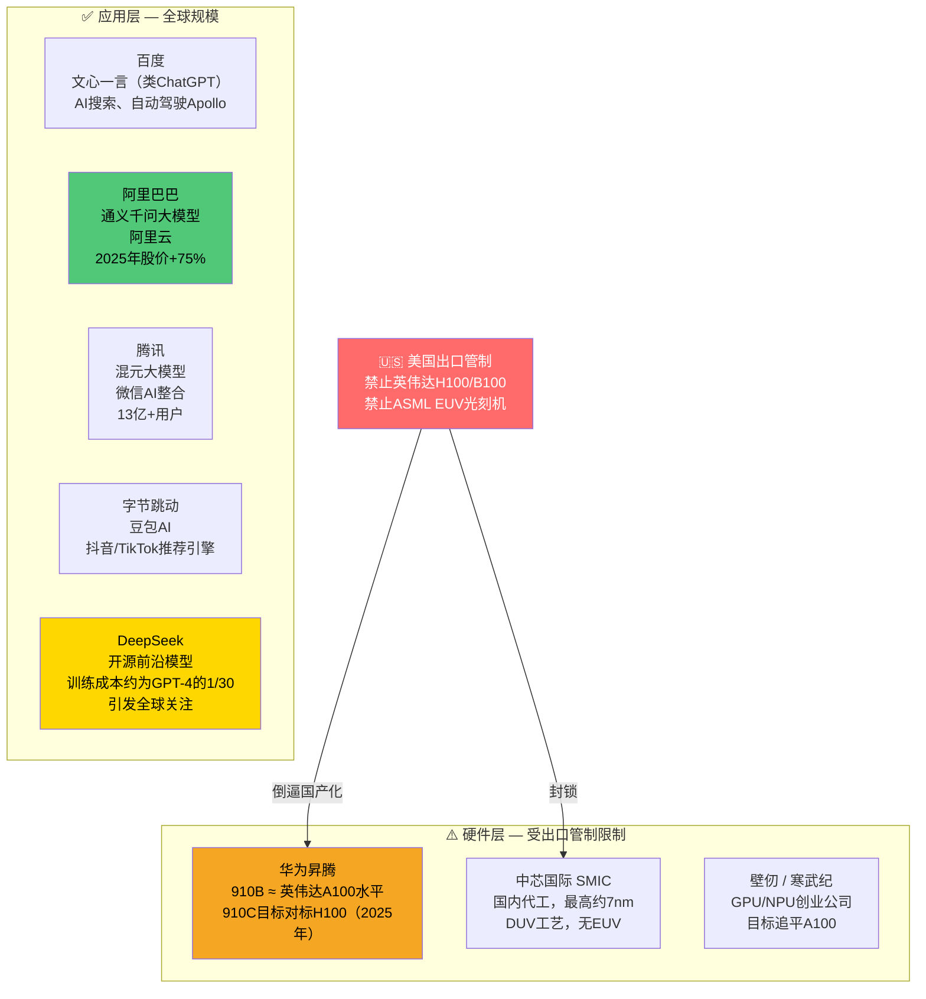
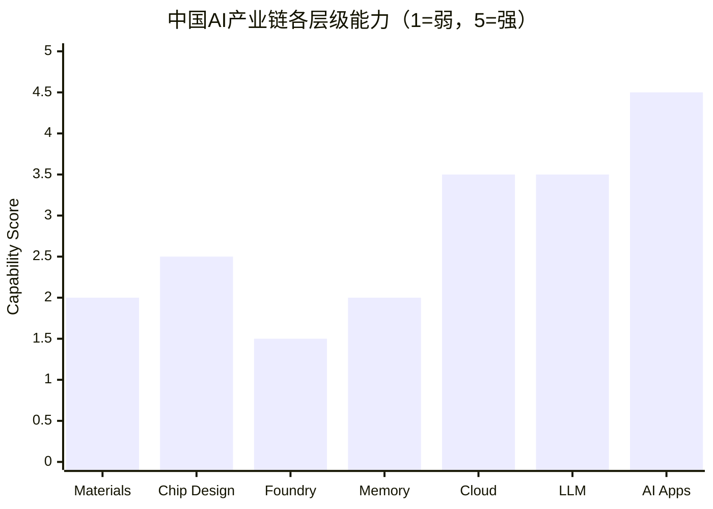
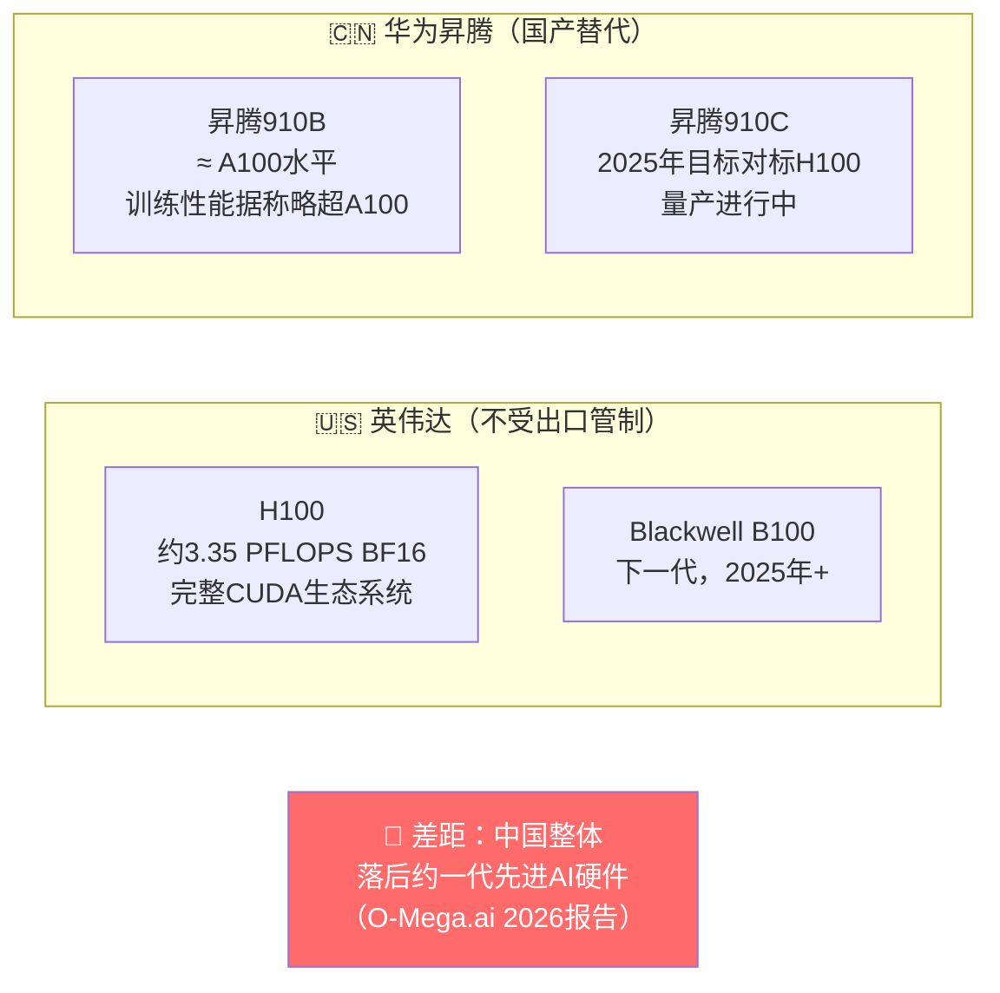
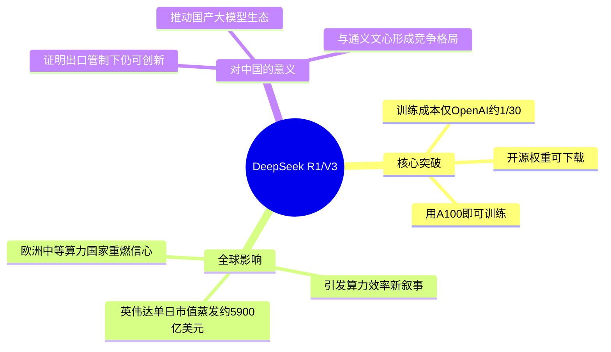

# 🇨🇳 沪深300 / 恒生指数 — 中国

> **产业链角色：** AI应用层 · 国产硬件突围 · 互联网平台 · 数据基础设施 信息来源：O-Mega.ai AI技术栈2026、CNN Business、Visual Capitalist（2024–2026）

---

## 指数概览

|指数|成分股数量|核心板块|
|---|---|---|
|**沪深300**|A股前300家|金融、消费、科技|
|**恒生指数**|约80家港股公司|科技、金融、地产|
|**科创板**|上交所科技板|芯片创业公司、AI企业|

**2025年表现：** 沪深300温和反弹；阿里巴巴（BABA）**+75.81%**，受AI转型驱动（CNN 2026）

---

## 产业链地位：应用层领先 + 硬件层受限

---

## 中国各产业链层级能力评分

> 柱图从左至右：原材料 · 芯片设计 · 代工制造 · 内存 · 云基础设施 · 大模型 · AI应用（评分1=弱，5=强）

---

## 华为昇腾 vs 英伟达对比

---

## DeepSeek — 改变格局的变量

---

## 主要公司与产业链层级

|公司|产业链层级|角色|
|---|---|---|
|**华为**|第二+五层|昇腾AI芯片、华为云（受限）|
|**中芯国际**|第三层——代工|国内代工，最高约7nm（仅DUV）|
|**阿里巴巴**|第五+六+七层|阿里云、通义千问、淘宝AI|
|**百度**|第六+七层|文心大模型、自动驾驶Apollo|
|**腾讯**|第六+七层|混元大模型、微信生态|
|**字节跳动**|第七层——应用|豆包AI、抖音推荐引擎|
|**DeepSeek**|第六层——模型|开源前沿模型，效率革命|

---

## 核心数据

|指标|数值|来源|
|---|---|---|
|阿里巴巴（BABA）2025年涨幅|**+75.81%**|CNN Business 2026|
|华为昇腾910B vs A100|**大致持平**|O-Mega.ai 2026|
|中芯国际最高制程节点（DUV）|**约7nm**|行业共识|
|中国AI应用层能力评分|**4.5/5**|O-Mega.ai分析|
|DeepSeek训练成本对比GPT-4|**约1/30**|多家媒体报道|

---

## 相关标签

`#中国` `#沪深300` `#恒生指数` `#阿里巴巴` `#华为` `#AI应用` `#出口管制` `#DeepSeek`

## 双向链接

[[00_AI产业链导航MOC]] · [[01_AI产业链总览]]