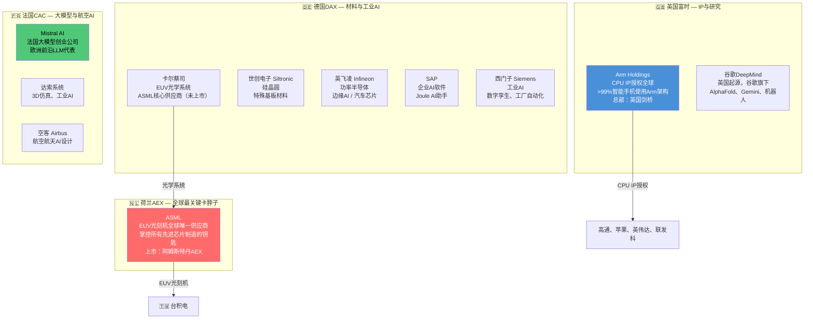
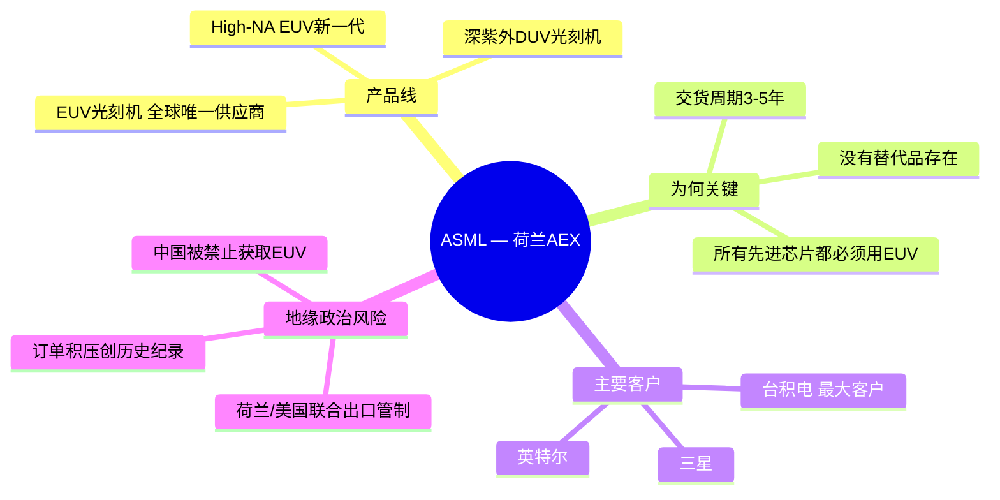
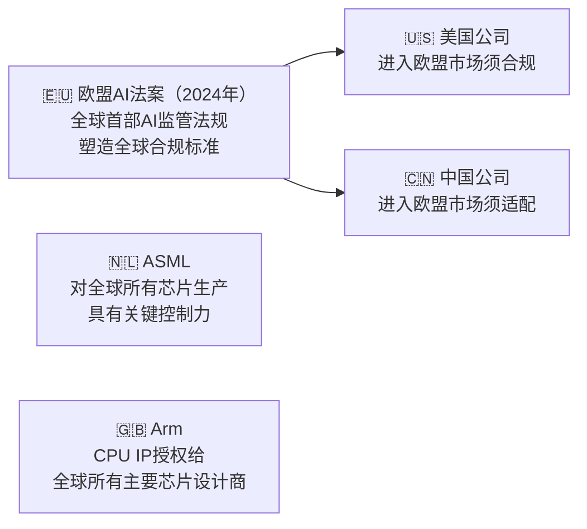

# 🇩🇪🇬🇧🇫🇷 DAX / 富时100 / CAC 40 — 欧洲

> **产业链角色：** EUV光刻设备（荷兰）· 工业AI · 半导体材料 · AI监管 · CPU架构IP
> 信息来源：Visual Capitalist、CNN Business、TradingView（2024–2026）

---

## 指数概览

| 指数 | 国家 | 成分股数量 | 核心板块 |
|------|------|----------|---------|
| **DAX 40** | 🇩🇪 德国 | 40家蓝筹股 | 汽车、化工、工业、金融 |
| **富时100（FTSE 100）** | 🇬🇧 英国 | 100家最大公司 | 金融、能源、矿业、消费 |
| **CAC 40** | 🇫🇷 法国 | 40家最大公司 | 奢侈品、航空航天、能源、金融 |

**2025年涨幅：** DAX **+23%** · 富时100 **+21.51%**（2009年以来最佳）· CAC 40 **-8.5%**（受中国敞口和奢侈品低迷拖累）

---

## 欧洲各国AI产业链角色

---

## ASML：真正的AI垄断企业

---

## 欧洲在AI产业链的战略杠杆

---

## 各公司产业链层级一览

| 公司 | 国家 | 产业链层级 | 角色 |
|------|------|----------|------|
| **ASML** | 🇳🇱 荷兰 | 第一层——设备 | 全球唯一EUV光刻机供应商 |
| **英飞凌** | 🇩🇪 德国 | 第二层——设计 | AI服务器/汽车功率芯片 |
| **世创电子** | 🇩🇪 德国 | 第一层——材料 | 硅晶圆 |
| **SAP** | 🇩🇪 德国 | 第七层——应用 | 企业AI（Joule AI助手） |
| **西门子** | 🇩🇪 德国 | 第七层——应用 | 工业AI、数字孪生 |
| **Arm Holdings** | 🇬🇧 英国 | 第二层——设计IP | 全设备CPU架构授权 |
| **谷歌DeepMind** | 🇬🇧 英国 | 第六层——模型 | Gemini、AlphaFold、前沿研究 |
| **Mistral AI** | 🇫🇷 法国 | 第六层——模型 | 欧洲前沿LLM |
| **达索系统** | 🇫🇷 法国 | 第七层——应用 | 3D/AI仿真设计 |

---

## 核心数据

| 指标 | 数值 | 来源 |
|------|------|------|
| DAX 2025年涨幅 | **+23%**（2019年以来最佳） | CNN Business 2026 |
| 富时100 2025年涨幅 | **+21.51%**（2009年以来最佳） | CNN Business 2026 |
| CAC 40 2024年涨幅 | **-8.5%**（中国/奢侈品拖累） | Visual Capitalist |
| ASML市场地位 | **EUV 100%垄断** | OECD 2025 |
| 欧盟AI法案执行时间 | **2025–2026年** | 欧盟官方来源 |

---

## 相关标签
`#欧洲` `#DAX` `#富时100` `#CAC40` `#ASML` `#Arm` `#EUV` `#工业AI` `#欧盟AI法案`

## 双向链接
[[00_AI产业链导航MOC]] · [[01_AI产业链总览]]
