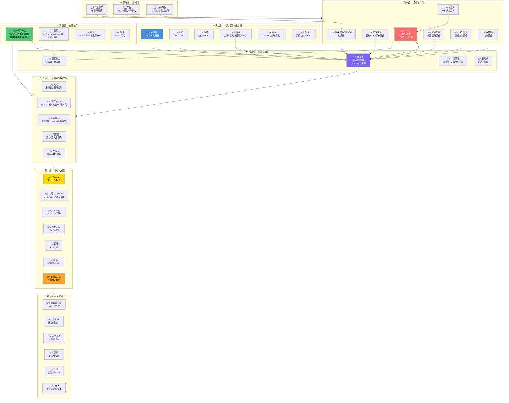
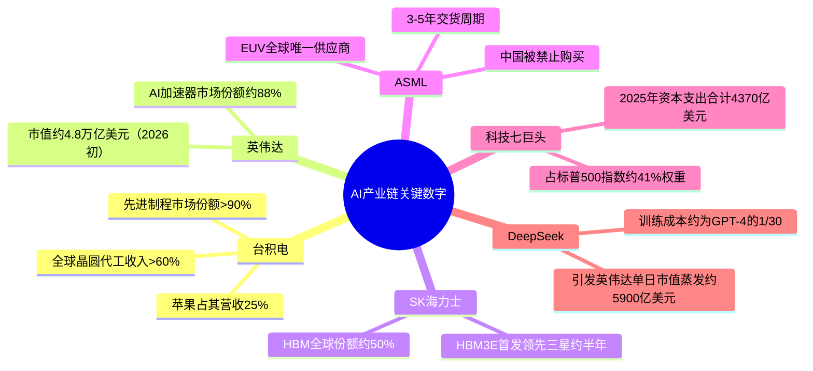

# 🗺️ AI产业链全链路总图 — 所有国家

> **从原材料到终端应用**的完整端到端产业链流程图
> 信息来源：OECD 2025、O-Mega.ai 2026、Engenia Technologies 2026、Sourceability 2025

---

## 完整端到端全链路流程

---

## 各国专业分工汇总表

| 国家 | 股票指数 | AI产业链主要角色 | 代表公司 |
|------|---------|----------------|---------|
| 🇺🇸 美国 | 标普500 / 纳斯达克 | 设计+云计算+大模型+应用 | 英伟达、微软、谷歌、苹果、亚马逊、Meta |
| 🇹🇼 台湾 | 台湾加权指数 | 制造（90%先进制程） | 台积电、联发科、日月光 |
| 🇰🇷 韩国 | KOSPI | 存储（HBM、DRAM、NAND） | SK海力士、三星 |
| 🇯🇵 日本 | 日经225 | 设备+材料+NAND | 东京电子、信越化学、铠侠 |
| 🇳🇱 荷兰 | AEX | EUV光刻（全球唯一供应商） | ASML |
| 🇩🇪 德国 | DAX | 材料+工业AI+企业软件 | 世创电子、英飞凌、SAP、西门子 |
| 🇬🇧 英国 | 富时100 | CPU IP+AI前沿研究 | Arm、DeepMind |
| 🇫🇷 法国 | CAC 40 | 大模型研究+航空航天AI | Mistral AI、达索系统 |
| 🇨🇳 中国 | 沪深300 / 恒生指数 | AI应用+国产硬件突围 | 阿里、百度、腾讯、字节跳动、华为、DeepSeek |

---

## 产业链关键数字速览

---

## 相关标签
`#全链路总图` `#AI产业链` `#全球分工` `#mermaid` `#产业研究`

## 双向链接
[[00_AI产业链导航MOC]] · [[01_AI产业链总览]]
