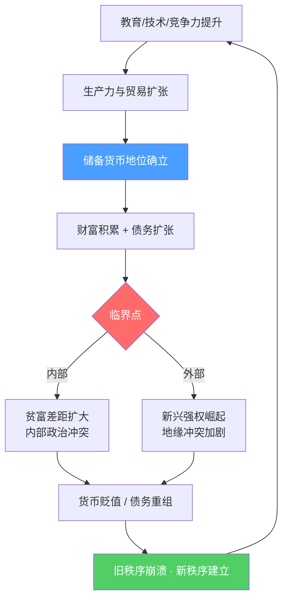
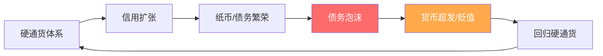

# 帝国兴衰的大周期框架

**Ray Dalio《变化中的世界秩序》The Changing World Order · 2020年**

---

## 核心论点

> The world order is now rapidly shifting in important ways that have never happened in our lifetimes but have happened many times before in history. Nearly all empires saw periods of ascendancy followed by periods of decline — driven by the same mechanics, just with different clothes and technologies. Because money and credit are the biggest single influence on how wealth and power rise and decline, if you don't understand how money and credit work, you can't understand the world order. Throughout history, rulers have run up debts that won't come due until long after their time — then the cycle resets.

**译：** 世界秩序正在以我们有生之年从未见过、但历史上反复发生的方式急剧转变。几乎所有帝国都经历过崛起与衰落——背后的机制完全相同，只是换了不同的主角和技术。货币与信用是财富和权力兴衰的最大单一驱动力，不理解货币信用就无法理解世界秩序。纵观历史，统治者总是借下在他们任期内不会到期的债务——然后周期重置。

---

## 核心机制图

---

## 八大国家实力指标

达利欧用以下八个维度衡量帝国兴衰，构成综合实力指数：

1. **教育** — 人力资本积累
2. **创新与技术** — 生产前沿的推进
3. **竞争力** — 经济效率
4. **经济产出** — GDP规模与增速
5. **世界贸易份额** — 国际经济影响力
6. **军事实力** — 硬实力保障
7. **金融中心地位** — 资本的全球枢纽
8. **储备货币地位** — 最终的软实力结晶

> 这八个指标相互强化——上升时形成正循环，衰退时形成负循环。

---

## 长期债务周期（50-75年）

**关键规律：**
- 债务周期约50-75年一个完整轮回
- 每次重置都伴随货币体系重构
- 战争往往是债务危机的加速器和终结者

---

## 三大储备货币帝国的兴衰对比

| | 荷兰帝国 | 大英帝国 | 美国 |
|---|---|---|---|
| 崛起驱动 | 贸易+金融创新 | 工业革命+殖民 | 二战后工业+美元 |
| 顶峰标志 | 阿姆斯特丹银行 | 英镑储备货币 | 布雷顿森林体系 |
| 衰退导火索 | 第四次英荷战争债务 | 两次世界大战耗竭 | 长期债务+中国崛起 |
| 货币结局 | 荷兰盾崩溃 | 英镑地位让渡美元 | 进行中 |

---

## 当前世界秩序的位置（2020年判断）

> The last major period of destroying and restructuring happened in 1930-45... It is now 75 years later, and we are classically near the end of a long-term debt cycle.

**译：** 上一次大规模破坏与重建发生在1930-45年……如今75年过去了，我们正处于长期债务周期末端的经典位置。

- 1945年建立的美元主导秩序已运行75年，处于长期债务周期末端
- 美国占全球GDP约20%，但美元仍占全球储备约60%——结构性错位
- 中国首次成为真正意义上的竞争性大国，在贸易、技术、地缘、资本市场全面竞争

---

## 关键命题提取

1. **历史不重复但押韵** — 同样的机制，不同的主角，一遍遍上演
2. **货币≠财富** — 印钱不能创造财富，只能重新分配财富
3. **债务吃掉权益** — Debt eats equity，债务危机中股权最先受损
4. **储备货币是最后的特权** — 也是最后失去的优势
5. **内部秩序先于外部秩序崩溃** — 贫富差距和内部冲突往往先于地缘战争

---

## 被引用于

- [[历史周期类比：70-80年代转型期]]
- [[地缘政治重构逻辑]]
- [[中美生产关系错配困境]]
- [[冷战缓和与资产轮动]]
- [[避险资产与生产力资产的平衡破裂]]
- [[金融制度的四次颠覆]]

---

原文来源：[The Changing World Order · Ray Dalio · 2020](https://www.economicprinciples.org)