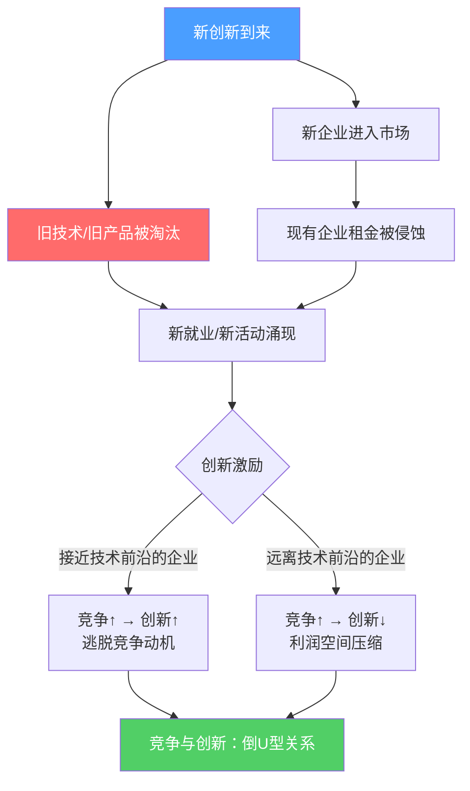
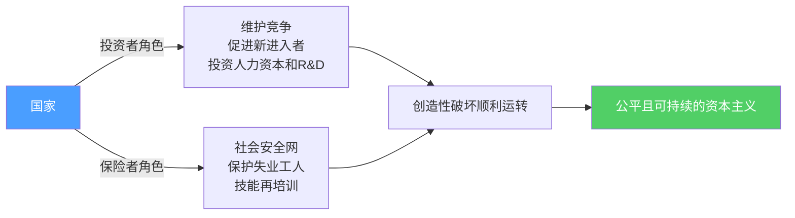

# 创造性破坏的力量

**Philippe Aghion, Céline Antonin, Simon Bunel**
**《The Power of Creative Destruction》Belknap Press, 2021**
**2025年诺贝尔经济学奖授奖研究**

---

## 核心原文（熊彼特原话，本书核心引用）

> The history of the productive apparatus of a typical farm...is a history of revolutions... This process of Creative Destruction is the essential fact about capitalism. It is what capitalism consists in and what every capitalist concern has got to live in.
>
> It is not that kind of competition which counts but the competition from the new commodity, the new technology, the new source of supply, the new type of organization — competition which commands a decisive cost or quality advantage and which strikes not at the margins of the profits and the outputs of the existing firms but at their foundations and their very lives.

**译：** 创造性破坏是资本主义的本质事实。真正重要的竞争不是价格竞争，而是来自新商品、新技术、新供给来源、新组织形式的竞争——这种竞争不是打击现有企业的利润边际，而是打击其根基和生命。

---

## 核心机制图

---

## 三大理论支柱

1. **站在巨人的肩膀上** — 每一项创新都建立在前人创新所积累的知识之上，创新具有累积性
2. **制度环境是创新的前提** — 需要强有力的产权保护和经济激励制度，知识才能被编码和传播
3. **竞争环境是创新的催化剂** — 新的创新企业必须能够无障碍进入市场，与现有企业竞争

---

## 核心发现：竞争与创新的倒U型关系

这是本书最重要的实证发现，打破了传统认知：

> 理论预测：任何削弱创新租金的因素（包括竞争加剧）都会损害创新
> 实证发现：行业竞争强度与生产率增长呈**正相关**

**解释：**
- 接近技术前沿的企业：竞争越激烈，创新动力越强（为了"逃脱"竞争）
- 远离技术前沿的企业：竞争越激烈，创新动力越弱（利润空间不足）
- 两种效应叠加 → **整体关系呈倒U型**

---

## 六大历史谜题的解答

| 谜题 | 创造性破坏的解释 |
|---|---|
| 工业起飞（1820年） | 英法知识传播体系+产权制度+人才竞争共同触发 |
| 技术革命与就业 | 自动化企业最终是净就业创造者，非净破坏者 |
| 长期停滞 | 超级明星企业压制后来者创新，竞争政策失效 |
| 中等收入陷阱 | 无法从要素积累转向创新驱动的制度失败 |
| 创新与不平等 | 短期加剧顶端不平等，长期促进社会流动，关系模糊 |
| 绿色转型 | 路径依赖锁定污染技术，需要政策干预重定向创新 |

---

## 四个被打破的"常识"

1. **对机器人征税能保护就业** — 错，自动化企业最终创造更多就业
2. **税收是促进包容性增长的主要工具** — 不完整，竞争政策同等重要
3. **保护主义能夺回价值链控制权** — 错，应对"中国冲击"靠创新补贴而非关税
4. **零增长是应对气候挑战的最佳方案** — 错，应重定向创新方向而非停止增长

---

## 国家的双重角色

---

## 关键命题

1. **创造性破坏是资本主义的本质** — 不是副作用，是核心机制
2. **竞争与创新非线性关系** — 不是越多竞争越好，而是倒U型
3. **技术革命不必然消灭就业** — 自动化企业是净就业创造者
4. **超级明星效应是增长的威胁** — 技术领先企业会主动压制后来者创新
5. **资本主义可以被引导** — 不同于熊彼特的悲观预言，适当监管下资本主义仍有活力

---

原文来源：Philippe Aghion, Céline Antonin, Simon Bunel, *The Power of Creative Destruction*, Belknap Press, Cambridge, 2021
书评来源：Alberto Bucci, *Journal of Economics* (2022) 135:299–306