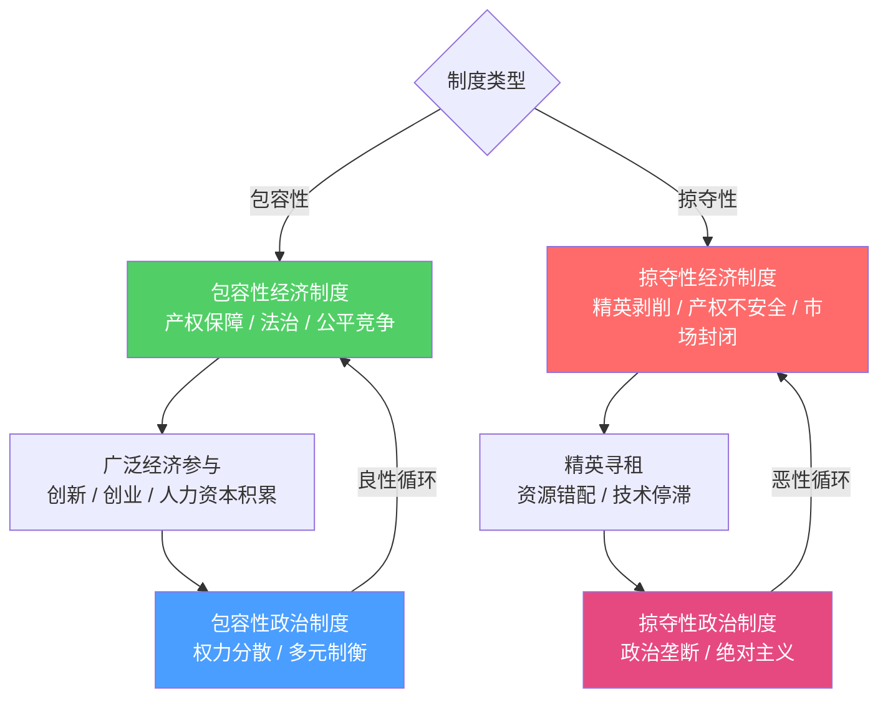

# 国家为什么会失败：制度决定论

**Daron Acemoglu & James A. Robinson《Why Nations Fail》Crown Publishers, 2012**
**2024年诺贝尔经济学奖授奖著作**

---

## 核心原文

> Countries such as Great Britain and the United States became rich because their citizens overthrew the elites who controlled power and created a society where political rights were much more broadly distributed, where the government was accountable and responsive to citizens, and where the great mass of people could take advantage of economic opportunities.

> Poor countries are poor for the same reason that Egypt is poor. Political power has been narrowly concentrated, and has been used to create great wealth for those who possess it.

> The different institutions create very disparate incentives for the inhabitants and for the entrepreneurs and businesses willing to invest there. These incentives are the main reason for the differences in economic prosperity.

**译：** 英美等国之所以富裕，是因为其公民推翻了垄断权力的精英，建立了政治权利广泛分配、政府对公民负责、普通人能够利用经济机会的社会。穷国贫穷的原因相同：政治权力高度集中，并被用来为少数掌权者积累财富。不同的制度为居民和投资者创造了截然不同的激励机制——这正是经济繁荣差异的根本原因。

---

## 核心机制图

---

## 两种制度对比

| | 包容性制度 Inclusive | 掠夺性制度 Extractive |
|---|---|---|
| 产权 | 广泛安全保障 | 仅精英享有 |
| 市场准入 | 开放竞争 | 精英垄断 |
| 政治权力 | 分散制衡 | 高度集中 |
| 对创新的态度 | 鼓励创造性破坏 | 抵制（威胁既得利益） |
| 典型案例 | 美国、英国、韩国 | 刚果、北朝鲜、殖民地拉美 |
| 长期结果 | 持续繁荣 | 贫困或短期增长后停滞 |

---

## 五大核心论点

**1. 制度决定激励，激励决定命运**
诺加利斯城被一道围栏分成南北两半，地理、气候、文化、族裔完全相同，仅因所属制度不同，北侧（美国）家庭年均收入是南侧（墨西哥）的三倍。

**2. 历史分叉与路径依赖**
英国光荣革命（1688年）限制王权、确立议会民主，为产权保护和工业革命奠基。西班牙殖民美洲建立的encomienda（劳役制）强制压低土著生活水平，将全部剩余产出榨取给西班牙人，形成延续数百年的路径依赖。

**3. 关键历史节点（Critical Junctures）**
同样面对黑死病，西欧劳动关系走向自由化，东欧却强化了农奴制。弗吉尼亚殖民地同样经历了这一节点：1619年弗吉尼亚公司被迫给予殖民者土地和议会权利，成为美国民主的起点。

**4. 良性循环与恶性循环**
- 包容性：权力分散→经济参与广泛→创新繁荣→制度进一步开放
- 掠夺性：精英控制政治→设计有利于自己的经济规则→财富集中→政治垄断更稳固

**5. 三种失败理论的批判**
- **地理假说** — 诺加利斯南北地理完全相同，贫富悬殊，地理无法解释
- **文化假说** — 朝鲜半岛文化高度同质，南北天壤之别；文化是制度的结果而非原因
- **无知假说** — 领导人选择有害政策不是因为无知，而是因为这些政策服务于其政治利益

---

## 关键命题

1. **制度决定激励** — 掠夺性制度下，努力工作和投资都是不理性的
2. **精英抵制创造性破坏** — 技术进步威胁其政治控制，因此被主动阻止
3. **政治权力决定经济制度** — 谁掌握政治权力，谁就设计对自己有利的规则
4. **掠夺性制度可以短期增长** — 苏联工业化、殖民地糖业均曾繁荣，但终究不可持续
5. **历史偶然性决定命运分叉** — 关键节点极为稀缺，大多数时候路径依赖锁死轨迹

---

## 被引用于

- [[旧生产关系破坏规律]]
- [[AI时代的制度滞后问题]]
- [[中美生产关系错配困境]]
- [[地缘政治重构逻辑]]
- [[生产要素变革与战争逻辑失效]]

---

原文来源：Daron Acemoglu & James A. Robinson, *Why Nations Fail: The Origins of Power, Prosperity, and Poverty*, Crown Publishers, New York, 2012
Archive链接：https://ia801506.us.archive.org/27/items/WhyNationsFailTheOriginsODaronAcemoglu/Why-Nations-Fail_-The-Origins-o-Daron-Acemoglu.pdf