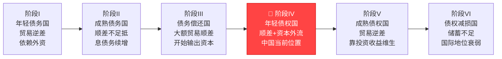
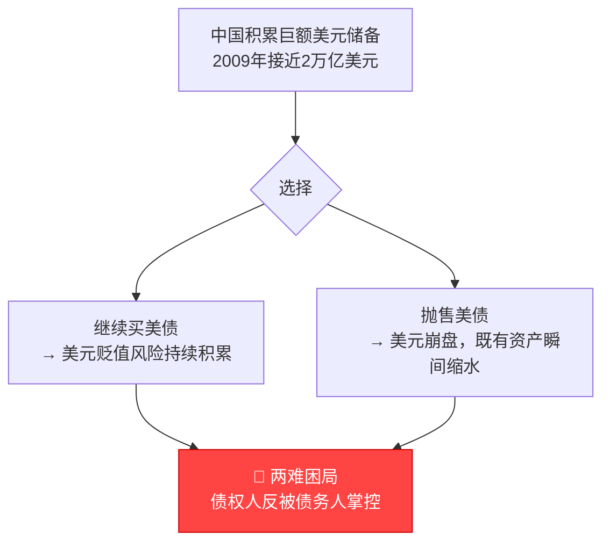
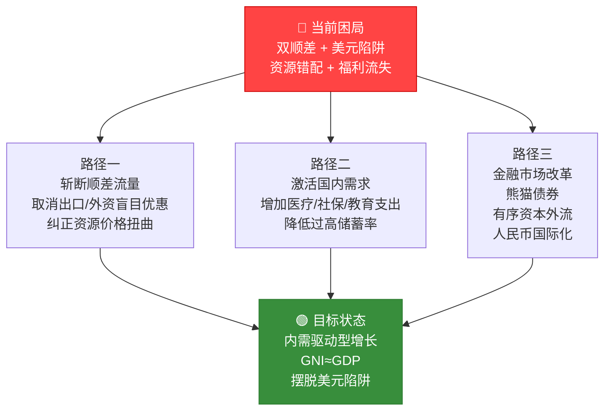

# 见证失衡（余永定）

## 核心观点
中国长期"双顺差"反映了国民经济的严重结构失衡：
一个人均收入较低的国家，却在过度储蓄的同时将实际资源廉价输送给最富有的国家。
这不是成功，而是资源错配——穷人把钱廉价借给富人，再用高利息借回来。

---

## 核心分析框架

### 储蓄-投资恒等式（全书最重要的分析工具）

\[ S - I = X - M \]

贸易顺差的本质 = 国内储蓄超过国内投资
> "贸易顺差的原因是国内储蓄大于国内投资。如果储蓄剩余不能消除，该国的贸易顺差就不可能消除。"
> —— p. 25

**推论**：中国的顺差问题无法靠汇率单独解决，必须从储蓄率和投资结构入手。

### 国际收支演化六阶段

> 来源：作者引用杰弗里·克洛舍（Geoffrey Crowther）六阶段假说，p. 35

### 美元陷阱（Dollar Trap）

中国作为美国最大债权人，陷入"不卖损失，卖了损失更大"的困局：

> "中国持有的美元太多，如果中国抛售美元就必然导致美元贬值，
> 并进而造成资本损失……这就是克鲁格曼所说的'中国的美元陷阱'。"
> —— p. 45

> 凯恩斯名言的反讽："当你欠银行1万英镑，你受银行摆布；
> 当你欠银行100万英镑，银行受你摆布。"
> 超级债务国（美国）反而掌握了主动权。

---

## 关键数据

| 指标 | 数据 | 预警意义 |
|---|---|---|
| 外汇储备 | 1996年1050亿美元 → 2006年突破1万亿 → 2009年约2万亿（p. 46, 80）| 全球最大外汇储备国 |
| 贸易顺差/GDP | 一度超过 **8%**（p. 23）| 远超国际预警线5% |
| FDI利润率 | **>20%**（汇回母国）| vs. 美债收益率不足3% |
| 结果 | GNI 长期低于 GDP | 国民福利持续流失 |

---

## 10个核心论断

1. **FDI是亏本买卖。**
   中国以高优惠引进外资，赚走20%利润；再把钱变成3%收益的美债。
   "引进了高利贷，买回了低收益资产。"（p. 142）

2. **人民币升值有阵痛，但有助于结构优化。**
   低汇率扭曲价格信号，使资源过度流向低附加值出口部门。（p. 113）

3. **维持固定汇率代价是丧失货币政策独立性。**
   大规模对冲操作耗尽货币政策空间。（p. 23）

4. **出口导向战略在21世纪初已过时。**
   80-90年代的成功战略，在双顺差时代成为结构调整的阻碍。（p. 16, 150）

5. **压低要素价格本质上是给外国消费者补贴。**
   廉价劳动力+环境成本外部化=中国纳税人补贴美国消费者。（p. 176）

6. **美元扩张必然导致中国外汇资产蒸发。**
   美国极度扩张的财政货币政策，使美元贬值不可避免。（p. 94）

7. **结构失衡无法靠宏观政策修正，必须制度创新。**
   政策工具只能治标，根本在于增长模式的彻底转变。（p. 141）

8. **减少顺差流量比优化存量更重要。**
   与其纠结已买下的美债，不如斩断持续流入的来源。（p. 227, 307）

9. **建议"熊猫债券"减少外储被动增长。**
   允许外国机构在中国发行人民币债券，疏导资金流向。（p. 289）

10. **人民币国际化是长期解药，前提是国内金融市场完善。**
    只有深厚的人民币金融市场，才能摆脱对美元的路径依赖。（p. 65）

---

## 出路：结构调整的三条路径

---

## 与佩雷斯框架的交叉点
- 佩雷斯的"安装期"描述金融资本脱离实体经济；余永定描述的是**国家层面的金融资本（外储）被困于他国实体**——两者都是资本错配，尺度不同
- 佩雷斯说发展中国家在"成熟期"容易成为资本流入地并埋下债务危机；余永定的中国案例是反例——**发展中国家成了债权国却反被套牢**
- 共同结论：**制度不调整，再大的顺差也会变成负担**

---

## 延伸思考
- 2025年中国外储约3.2万亿美元，"美元陷阱"是否比2009年更深？
- 人民币国际化推进了十余年，离"摆脱美元陷阱"还有多远？
- 余永定主张升值，但日本"广场协议"后的教训是否说明升值本身也有陷阱？
- 双顺差时代已过，中国当前面临的是资本外流压力——国际收支格局是否已进入阶段V的边缘？
- 稳定币（USDT）的崛起，是否会在微观层面绕过余永定所担忧的外汇管制，形成新的资本外逃通道？

---

> 来源：《见证失衡：双顺差、人民币汇率和美元陷阱》
> 作者：余永定，中国社会科学院学部委员、前央行货币政策委员会委员
> 精华整理 via Gemini，卡片格式整理 via Perplexity
