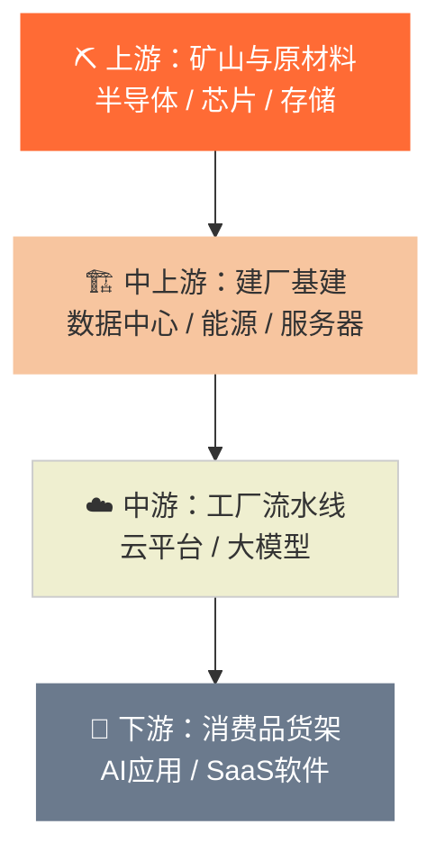
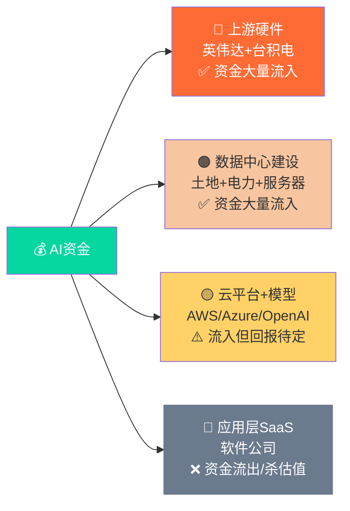
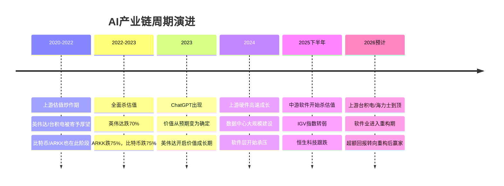

# 🏭 AI产业链全景图

> **一句话理解**：AI产业链就像盖一座超级工厂——先要有**矿山和原材料**（上游硬件），再要有**建设施工队**（数据中心），然后是**工厂里的机器和流水线**（云平台+模型），最后才能生产**卖给消费者的产品**（应用层）。

---

## 🗺️ 产业链总览（一张图）



---

## 🔴 第一层：上游硬件层（矿山 + 炼钢厂）

> **比喻**：就像炼钢厂，没有钢铁，后面所有建筑都无从谈起。现在全球都在抢这层的资源。

### 核心玩家

|角色|公司|类比|
|---|---|---|
|🏆 GPU算力核心|**英伟达 NVIDIA**|最抢手的"超级电钻"|
|🔬 芯片代工厂|**台积电 TSMC**|专门帮人造零件的"精密铸造厂"|
|💾 高速内存(HBM)|**SK海力士、三星、美光**|AI运转需要的"超大工作台"|
|⚙️ 芯片设计|**Broadcom、Marvell、AMD**|画图纸的设计院|

### 当前周期状态

```
📈 状态：价值确定期（成长阶段）
🎯 英伟达：已完成"杀估值→价值确定"转换，进入稳定成长
🎯 台积电 & 海力士：需求扩张中，预计6个月内到达阶段顶峰
💰 资金热点：A股超额收益主要来自这一层的政府驱动创新
```

### 关键数据

- 英伟达AI业务年收入 **844亿美元**（数据中心占总营收87.5%）
- 台积电AI相关营收预计 **104亿美元**
- AMD AI营收预计 **45亿美元**
- HBM内存市场 **约160亿美元**（SK海力士占46-52%）

---

## 🟠 第二层：基础设施层（建工厂 + 买地买电）

> **比喻**：造芯片是原材料，但还需要有人去买地、建厂房、接水接电。这层干的就是"房地产+电力"的活。

### 核心玩家

|角色|公司/类型|类比|
|---|---|---|
|🏢 数据中心开发商|Vantage、QTS、CyrusOne|工业园区开发商|
|🖥️ 服务器制造|**戴尔Dell、超微SMCI**|把零件组装成机器的厂|
|⚡ 能源供应|电力公司、核电|给工厂供电的电网|
|❄️ 冷却设备|Vertiv、ABB|防止机器过热的空调系统|

### 关键趋势

- 四大科技巨头（微软/谷歌/亚马逊/Meta）过去四季度资本支出合计 **1770亿美元**，同比增长59%
- **约50%支出**用于GPU等设备，另50%用于**土地和电力**（未来15年稀缺资源）
- 电力正成为最大瓶颈：美国电力拍卖价格一年暴涨**10倍**

> 💡 **谷歌CEO名言**："投资不足的风险比投资过度的风险更大。"

---

## 🟡 第三层：云平台 + 大模型层（工厂流水线）

> **比喻**：厂房建好了，里面要有流水线（云计算平台）和核心机器（AI大模型）。这层卖的是"算力使用权"。

### 核心玩家

|角色|公司|类比|
|---|---|---|
|☁️ 云平台|**AWS、Azure、Google Cloud**|出租流水线的"工业园运营商"|
|🤖 模型公司|**OpenAI、Anthropic、Cohere**|研发核心机器的"技术公司"|
|🗄️ 数据基础设施|Databricks、Snowflake|管理原料仓库的"仓储系统"|

### 当前周期状态

```
⚠️ 状态：估值回调 / 创造性破坏阶段（中游杀估值期）
• 恒生科技（腾讯/阿里/美团等）本质属于这一层
• IGV（美股软件指数）自2025年11月开始转弱
• 市场开始质疑：AI会不会干掉现有软件产业？
```

---

## 🔵 第四层：应用层（消费品货架）

> **比喻**：流水线出来的产品，最终要卖给消费者。这层才是普通人每天接触到的AI。

### 两大方向

**🛍️ 消费级应用**

- Perplexity（AI搜索）
- Midjourney（AI作图）
- 各类AI助手

**🏢 企业级应用（垂直SaaS）**

- Microsoft Copilot（办公AI）
- Harvey（法律AI）
- Glean（企业搜索）

### 当前周期状态

```
🔨 状态：创造性破坏期（正在重构）
• 软件行业不会消失，但会被AI彻底重写
• 部分公司被淘汰，有护城河的公司获AI赋能重生
• 超额回报将在"重构完成后"的阶段集中产生
```

---

## 📊 各层资金流向总结



---

## 🌏 各市场与产业链位置对照

|市场|代表标的|产业链位置|当前表现原因|
|---|---|---|---|
|🇺🇸 美股英伟达|NVDA|上游产品端|周期领先，进入价值确定期|
|🇹🇼 台湾股市|台积电|上游制造端|需求扩张，成长期未完|
|🇰🇷 韩国股市|SK海力士|上游存储端|同台积电逻辑|
|🇨🇳 A股|AI硬件相关|上游早期|政府驱动，估值扩张期|
|🇭🇰 恒生科技|腾讯/阿里/美团|**中游软件平台**|跟随美股软件杀估值 ⬇️|
|🇺🇸 美股IGV|微软/Salesforce/Adobe|中游软件|创造性破坏期 ⬇️|

> 🔑 **核心结论**：恒生科技弱不是因为中国宏观问题，而是因为这些公司本质是"互联网平台/中游软件"，全球这一层都在调整。

---

## ⏳ 产业生命周期时间轴



---

## 💡 给投资者的简明结论

> **现在在哪儿？**
> 
> - 🔴 上游硬件：还有6个月左右成长窗口期，之后转成熟
> - 🟡 中游软件：正在经历痛苦的"破坏性重构"，有护城河的活，没护城河的死
> - 🔵 应用层：重构完成后才是真正爆发期，现在耐心等待

> **一个比喻总结全局**： 现在是AI"工业革命"的第二阶段。 第一阶段：大家疯狂买铲子（英伟达）、建工厂（数据中心）。✅ 已完成并进入成熟期 第二阶段：旧工厂被新机器砸烂重建（软件业重构）。🔨 正在进行 第三阶段：新工厂里生产出真正改变生活的产品（应用层爆发）。⏳ 等待中

---

_资料来源：《AI市场的资本谜团与流向》/ 付鹏说19《从AI产业链视角理解恒生科技的疲弱走势》/ 付鹏说20《从企业生命周期再看AI产业链》_ _整理时间：2026年3月_

---

## 支撑的论点

- [[AI基础设施建设周期]]：AI产业链全景图明确描述了AI基础设施建设的规模和阶段——四大科技巨头过去四季度资本支出合计1770亿美元，处于建设高峰期。
- [[科技基建的钢铁水泥类比]]：AI产业链全景图明确将台积电和SK海力士定位为"科技基建的核心原材料供应商"，并指出上游原材料领域的周期收尾意味着AI基础设施建设基本完成。
- [[台积电]]：AI产业链全景图将台积电定位为"上游制造端"，AI相关营收预计104亿美元，处于"需求扩张，成长期未完"阶段。
- [[SK海力士]]：AI产业链全景图将SK海力士定位为"上游存储端"，HBM内存市场约160亿美元，SK海力士占46-52%。
- [[算力中心与数据中心]]：AI产业链全景图详细描述了数据中心建设的规模——四大科技巨头过去四季度资本支出合计1770亿美元，约50%用于土地和电力。
- [[2026年投资逻辑转变]]：AI产业链全景图明确指出2026年的投资逻辑转变——上游台积电/海力士到顶，软件业进入重构期，超额回报转向重构后赢家。
