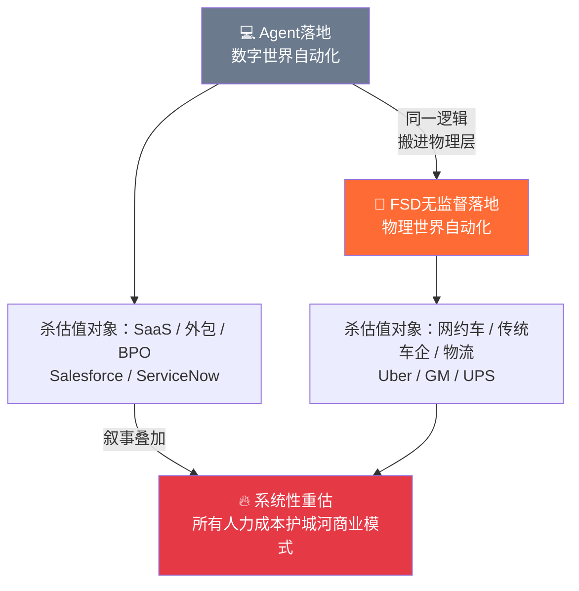
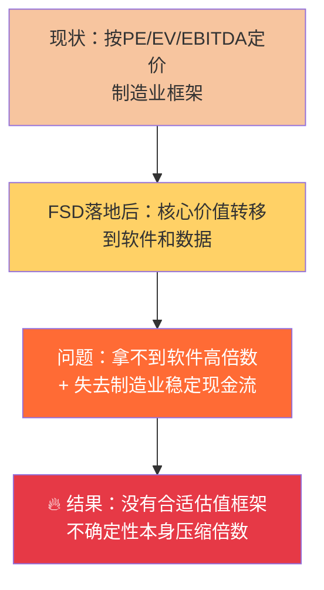
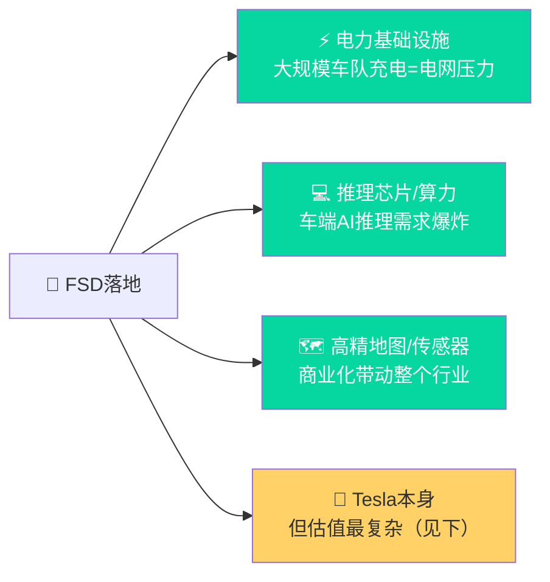
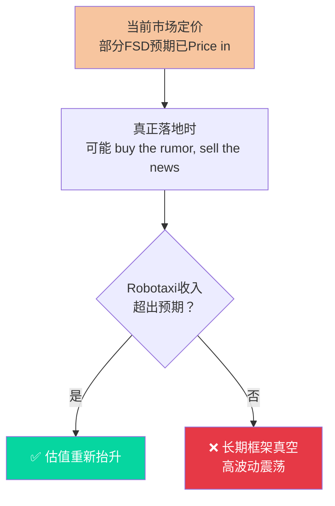

# 🚗 FSD落地与权益市场重估：从Agent到物理层自动化

> **一句话理解**：Agent在数字世界替代白领工作流，正在杀软件股估值；如果FSD无监督版本落地，就是同样的逻辑搬进物理世界——届时被重估的不只是汽车行业，而是**所有以人力成本为护城河的商业模式**。

---

## 🗺️ 核心类比框架



---

## 🔍 三波冲击路径（假设12-18个月内FSD商业化落地）

### 🔴 第一波：直接替代——商业模式被摧毁

|行业|公司|冲击逻辑|估值影响|
|---|---|---|---|
|网约车平台|Uber / Lyft|司机侧被车辆替代，双边网络效应变单边；Tesla自营Robotaxi边际成本→0|P/S从3-4x压缩至1x以下，从科技公司重估为流量聚合商|
|传统车险|Allstate / Progressive|责任主体转移到软件公司；Tesla车端数据碾压传统精算模型|商业模式结构性破坏|

> ⚡ **最脆弱的是Uber**：它没有车，没有数据，只有撮合关系——而这恰恰是FSD最先消灭的东西。

---

### 🟠 第二波：估值框架失效——传统OEM双重戴维斯杀



**二阶效应（几乎无人讨论）**：

- 二手车残值下降 → 汽车金融子公司（GM Financial / Ford Credit）资产质量恶化
- 消费者"等待自动驾驶车"心态 → 传统车型销量预期持续下修

---

### 🔵 第三波：叙事溢出——非汽车行业也被重估

|行业|冲击路径|时间维度|
|---|---|---|
|物流/快递 UPS/FDX|最后一公里+长途干线被替代；护城河从规模变成"谁先买到车队"（资本密集度急升）|中期|
|商业地产REITs|停车场价值归零；通勤半径扩大→城市核心商业需求下降|长期|
|人力外包/BPO|FSD+Agent叙事叠加：物理+数字劳动力同时被替代预期打压|中期|

---

## ✅ 谁是赢家（被低估的受益方）



---

## 🧩 Tesla估值的特殊悖论

> **最大受益者 ≠ 最安全的多头**



|资产|市场定价状态|
|---|---|
|车端数据飞轮（每天数百万辆真实路况）|⚠️ 严重低估|
|垂直整合能力（芯片+软件+硬件）|✅ 部分定价|
|Robotaxi网络期权价值|❓ 高度不确定|
|能源业务 Megapack|❌ 几乎被忽视|
|Optimus机器人|🔮 当科幻定价|

> 真正的问题：**没有任何现有估值框架能准确定价Tesla**，这本身就是巨大的波动性来源。

---

## 🎯 PLTR错杀：提供参考框架

> Palantir在"AI杀估值"行情里被错杀，原因是市场**用错了框架**——把它当SaaS杀，但它实际上是国防基础设施。

**哈梅内伊斩首行动的市场启示**：

- 军方AI应用已达到**实战闭环**阶段（情报融合→目标确认→执行授权）
- Palantir的护城河是**信任和涉密资质**，不是技术——开源模型替代不了
- 每次军事AI事件曝光 = AI实战成熟度**远超市场公开认知**的信号

**PLTR vs Tesla 错杀对比**：

|维度|PLTR|Tesla|
|---|---|---|
|错杀原因|用SaaS框架定价国防基础设施|用车企框架定价AI数据公司|
|修复路径|清晰：下一份政府合同即触发|复杂：需FSD商业化兑现|
|估值锚|有（政府合同可见度高）|无（框架真空）|
|错杀持续时间|短|可能较长|
|波动性|中|极高|

---

## ⏳ 冲击时间轴

```timeline
    title FSD落地权益市场冲击路径
    T+0落地宣布 : 网约车平台暴跌
               : Tesla短期buy the news后可能回调
               : 传统车险股开始承压
    T+1到3个月 : 传统OEM估值框架开始被质疑
              : 物流公司资本开支策略被重新审视
    T+6到12个月 : Robotaxi收入数据开始验证
               : Tesla重新定价为AI+出行+能源复合体
               : 电力基础设施需求预期抬升
    T+12个月以上 : 二手车残值下降传导至汽车金融
                : 商业地产局部重估（停车场最先）
                : Agent+FSD叙事合流，系统性打压人力成本护城河资产
```

---

## 💡 核心结论

> Agent打压软件股 = 市场在说"白领边际价值在下降" FSD商业化 = 市场开始说"蓝领物理劳动边际价值也在下降"
> 
> 两个叙事叠加后，**所有以人力成本为护城河的商业模式**都面临系统性重估。
> 
> 判断是否"错杀"的核心问题只有一个： **你对AI实战成熟度的判断，是否比市场共识更超前？** 如果是——错杀就是入场窗口。

---

_资料来源：与Claude对话整理 / 2026年3月7日_