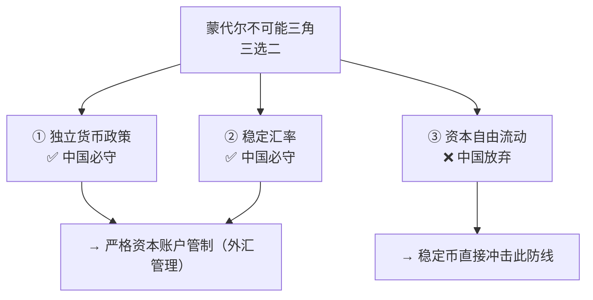

# 境内监管下，稳定币应有的一线生机

## 核心观点
稳定币已不可逆地成为全球贸易的基础设施，是一种事实上的"全球离岸外汇"。
中国不需要全面拥抱，但必须为出海企业的真实贸易场景留下一线合法合规的生路——
管住该管的（货币主权、外汇秩序、违法犯罪），放开该放的（真实跨境贸易收付与结汇）。

---

## 当前监管现状：全面一刀切

中国对稳定币的监管沿革：
- 2013：风险提示，不禁止个人自担风险交易
- 2017：叫停 ICO 发行
- 2021（924通知）：全面定性非法金融活动，禁止境外机构境内展业，禁止全链条服务支持
- 2025（42号文）：单独点名稳定币，全环节穿透监管

**现实中的五个"不能"：**
- 境内企业不能发行稳定币
- 境内机构不能做稳定币与法币的兑换
- 境内企业境外真实贸易，不能用稳定币合规收付款
- 境内科技公司不能为稳定币收付提供技术支持
- 出海赚的稳定币不能合规结汇成人民币回国

> 司法实践：924通知后，法院绝大多数以"违背公序良俗"
> 认定虚拟货币交易无效；私下兑换轻则冻卡，重则以
> **非法经营罪、非法买卖外汇罪**立案侦查。

---

## 墙外的稳定币：庞大的平行货币世界

稳定币已从币圈投机工具演变为全球跨境支付的底层基础设施。

**规模数据（2025年底）：**
- USDT 发行量：超 **1860亿美元**，总资产约1929亿美元
- USDC 发行量：约 **752亿美元**，储备资产约753亿美元
- 全球稳定币市场总规模：超 **3100亿美元**（路透，2026年2月）
- 仅 USDT+USDC = 港币现金流通量的 **3倍**、新加坡币的 **5倍**、日本现金流通量的 **1/3**

**流转速率（Velocity）= 113次/年**，说明稳定币被高频用于真实商业支付，而非屯币。

**对比传统跨境支付（SWIFT+CHIPS）的优势：**
| 维度 | 传统跨境支付 | 稳定币 |
|---|---|---|
| 到账时间 | T+2 甚至更久 | 几秒内到账 |
| 手续费 | 中间行层层收费 | 几美分（Solana/Layer 2）|
| 可用时间 | 工作日营业时间 | 7×24小时 |
| 门槛 | 需银行账户体系 | 仅需区块链钱包地址 |

---

## 为什么稳定币是 AI 时代的必选项

AI Agent 的爆发直接引爆了稳定币的新需求场景。

> 2025年9月，Citrini Research 发布报告指出：
> AI Agent 的自动化微交易（如 $0.001 的 API 调用费），
> 无法承担信用卡 $0.3 固定手续费，
> 最终**绝大多数 AI Agent 选择通过 Solana 或以太坊 Layer 2 使用稳定币结算**。
> 该报告导致 Mastercard 和 Visa 股价单日暴跌近 5%。

行业跟进动作：
- Stripe × OpenAI：发布"代理商业协议（Agentic Commerce Protocol, ACP）"
- Coinbase：推出"Agentic Wallets（智能体钱包）"，允许 AI 系统自主用稳定币交易

> 结论：稳定币很可能演变为"机器经济和 AI 时代的底层结算协议"。
> 一刀切禁止稳定币 = 主动切断未来 AI 商业网络的支付大动脉。

---

## 为什么不能全面放开：蒙代尔不可能三角

监管的核心苦衷来自宏观经济学的基本约束。

**两大核心风险：**

**风险一：资本外逃**
用人民币场外买 USDT → 转移至境外钱包 → 换成美元，
可彻底绕过外汇防火墙。IMF 研究证实，资本管制国家中加密货币逃汇极为猖獗。

**风险二：数字美元化（Digital Dollarization）**
截至2026年2月，全球 **99% 以上**的稳定币是美元计价。
若 USDT 在境内流通，实质上将央行货币政策权拱手让给美联储。
Tether 底层储备中超 **1220亿美元**是美国国债，
已成全球最大美国政府债券持有者之一。

---

## 应有的监管框架：管住该管的，放开该放的

**参照现行外汇管理框架**——美元、欧元在中国有序管理，稳定币同理。

### 必须管住的三条线
1. **境内发行与流通**：禁止境内发行稳定币；禁止稳定币在境内作为货币计价、流通、结算
2. **面向境内个人的投机炒作**：禁止境外交易所向境内居民开户；打击杠杆/衍生品交易
3. **借稳定币实施的违法犯罪**：洗钱、电诈、非法集资、跨境赌博等零容忍

### 应当放开的一线生机
**核心诉求：真实贸易背景下的境外稳定币收付合法化**

三个核心限定（确保风险可控）：
- **主体限定**：境内企业的境外分支机构、离岸主体，或开展真实跨境贸易的境内主体
- **场景限定**：必须有完整贸易合同、物流凭证、报关单等真实贸易背景证明
- **地域限定**：至少一方为境外主体，不涉及境内稳定币兑换与流通

**合规结汇通道设计（参考跨境电商外汇结算模式）：**
1. **主体持牌**：仅持牌银行/支付机构可办理稳定币结汇业务
2. **交易审核**：企业提交完整贸易背景材料，持牌机构严格核验
3. **资金管控**：稳定币转入合规托管钱包，等同外汇储备管理；企业感知上等同结汇
4. **收支申报**：持牌机构完成国际收支申报，企业依法完成纳税申报，全程可追溯

> 附带放开：境内科技公司、律所、会计师事务所，
> 可为出海企业跨境稳定币收付提供**技术开发、合规咨询、审计服务**，
> 不应被认定为"为虚拟货币活动提供技术支持"。

---

## 延伸思考
- 人民币稳定币（离岸 CNH 稳定币）是否是中国在这个领域的战略出路？
- 香港作为"一国两制"下的稳定币试验场，能否为境内监管提供参考路径？
- AI Agent 时代，稳定币与 CIPS（人民币跨境支付系统）是竞争还是互补关系？
- "真实贸易背景"的核验在实操中如何防止造假？监管成本是否可接受？
- 全球 99% 稳定币为美元计价的现状，是否会倒逼中国加速推进数字人民币的离岸化？

---

> 来源：[一川深度丨境内监管下，稳定币应有的一线生机 - 一川Law，微信公众号](https://mp.weixin.qq.com/s/amhd98OZJOgmLjzKuecVzQ)
> 作者：权威、李珣、郑博、洪松（2026年3月2日）

---

## 支撑的论点

- [[区块链与贸易清结算]]：稳定币是区块链清结算的核心载体，境内监管下稳定币的生存空间直接决定了区块链清结算在中国的可行路径。
- [[金融制度的四次颠覆]]：稳定币代表金融制度第四次颠覆（数字货币/区块链）的具体形态，其监管博弈是这一颠覆过程的缩影。
- [[AI时代的制度滞后问题]]：稳定币监管的"一刀切"困境，是AI时代制度滞后问题的典型案例——技术已经跑在前面，制度还在追赶。
