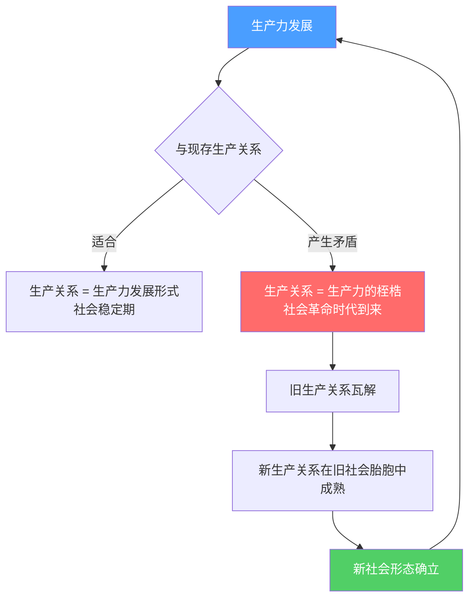

# 生产力与生产关系的矛盾运动

**卡尔·马克思《政治经济学批判·序言》1859年**

---

## 核心原文

> 人们在自己生活的社会生产中发生一定的、必然的、不以他们的意志为转移的关系，即同他们的物质生产力的一定发展阶段相适合的生产关系。
>
> 社会的物质生产力发展到一定阶段，便同它们一直在其中运动的现存生产关系或财产关系发生矛盾。于是这些关系便由生产力的发展形式变成生产力的桎梏。那时社会革命的时代就到来了。
>
> 无论哪一个社会形态，在它所能容纳的全部生产力发挥出来以前，是决不会灭亡的；而新的更高的生产关系，在它存在的物质条件在旧社会的胎胞里成熟以前，是决不会出现的。

---

## 核心机制

---

## 关键命题

1. **生产关系由生产力决定** — 生产关系必须与生产力发展阶段相适合
2. **矛盾必然产生** — 生产力持续发展，旧生产关系迟早变成桎梏
3. **革命时机** — 新生产关系需物质条件成熟，不能提前也不会滞后
4. **旧形态不会提前灭亡** — 在耗尽其全部生产力潜力前不会消亡

---

## 引用

- [[旧生产关系破坏规律]]
- [[2026年市场阵痛期]]
- [[历史周期类比：70-80年代转型期]]
- [[中美生产关系错配困境]]
- [[AI对职业结构的冲击]]

---

原文来源：[马克思主义文库·《政治经济学批判》序言](https://www.marxists.org/chinese/marx/06.htm)

---

## 支撑的论点

- [[旧生产关系破坏规律]]：马克思的"生产力与生产关系矛盾运动"是旧生产关系破坏规律的理论基础——AI作为新生产力，必然与旧生产关系产生矛盾，旧生产关系变成"桎梏"是历史必然。
- [[2026年市场阵痛期]]：马克思的"社会革命时代"命题解释了2026年阵痛期的历史必然性——新生产力（AI）已经发展到与旧生产关系产生矛盾的阶段，阵痛是革命的前奏。
- [[历史周期类比：70-80年代转型期]]：马克思的框架解释了70-80年代转型期的本质——信息技术作为新生产力，与工业时代的旧生产关系产生矛盾，推动了里根/撒切尔改革。
- [[中美生产关系错配困境]]：马克思的"生产关系必须与生产力发展阶段相适合"命题，解释了中美生产关系错配的根本原因——两国的生产关系都未能适应新生产力的发展阶段。
- [[AI对职业结构的冲击]]：马克思的"旧生产关系变成生产力的桎梏"命题，解释了AI对职业结构冲击的历史必然性——旧的职业结构（生产关系）已经成为AI生产力发展的桎梏。
