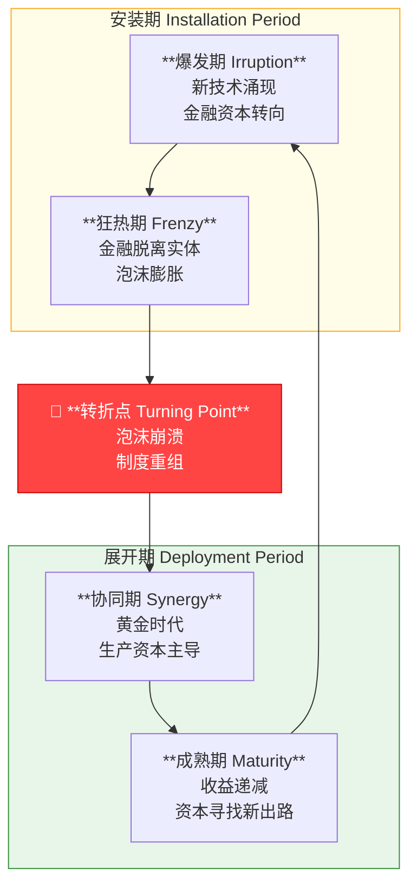
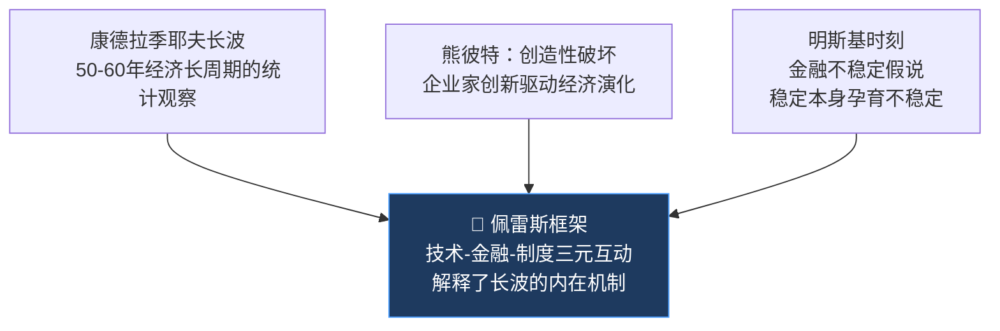

# 技术革命与金融资本（佩雷斯）

## 核心观点
经济增长以"技术革命"为引擎，每隔约半世纪爆发一次"发展大浪潮"。
金融资本与生产资本的周期性分离与重合，是驱动繁荣与危机交替的核心机制——
泡沫不是偶然错误，而是系统必然；黄金时代永远发生在泡沫破裂后的制度重组之后。

---

## 核心分析框架

### 发展大浪潮的生命周期

### 技术-经济范式（Techno-Economic Paradigm）
不只是新技术，而是一套改变**所有行业**成本结构与组织逻辑的"常识体系"。
> "A techno-economic paradigm is a best-practice model made up of a set of all-pervasive generic technological and organizational principles... When generally adopted, these principles become the common-sense basis for organizing any activity."
> —— p. 15

| 浪潮 | 旧范式常识 | 新范式常识 |
|---|---|---|
| 第四次→第五次 | 大规模生产、标准化、能源密集 | 信息密集、分散网络、定制化与灵活性 |

### 金融资本 vs 生产资本

| 维度 | 金融资本 | 生产资本 |
|---|---|---|
| 本质 | 流动、机会主义，让货币增值 | 固定、积累知识，创造真实产品 |
| 行业忠诚度 | 无，追逐最高利润 | 高，依赖特定技术路径与市场 |
| 在周期中的角色 | 安装期主导：打破旧结构、资助新技术 | 展开期主导：创造社会财富 |

> "Financial capital is mobile by nature while production capital is basically tied to concrete products... For production capital, knowledge about product, process and markets is the very foundation of potential success."
> —— p. 72

---

## 五次技术革命历史分期

| # | 名称 | 核心国家 | 爆发标志（Big-bang） | 年份 |
|---|---|---|---|---|
| 1 | 工业革命 | 英国 | 阿克莱特克罗姆福德工厂开业 | 1771 |
| 2 | 蒸汽与铁路时代 | 英国→欧美 | 火箭号蒸汽机车测试成功 | 1829 |
| 3 | 钢铁、电力与重工程 | 美国、德国 | 卡内基贝塞麦炼钢厂投产 | 1875 |
| 4 | 石油、汽车与大规模生产 | 美国→欧洲 | 福特 T 型车下线 | 1908 |
| 5 | 信息与通信技术 | 美国→欧亚 | 英特尔发布微处理器 | 1971 |

**第五次浪潮（信息时代）时间轴（2002年视角预测）：**
- 爆发期：1971–1987
- 狂热期：1987–2001（互联网泡沫）
- 转折点：2001–？（制度重组期）
- 协同/成熟期：21世纪初至中期

---

## 10个核心论断

1. **技术变革引发金融泡沫是系统必然，而非偶然错误。**
   金融资本必须过度投资新基础设施（运河、铁路、光纤），才能确立新范式。（p. 106-107）

2. **黄金时代总是发生在泡沫破裂后的制度重组之后，而非泡沫期间。**
   真正的繁荣需要从"纸面财富"回归"实体生产"。（p. 5）

3. **金融资本与生产资本的功能分离，是资本主义适应技术变革的机制。**
   金融负责在旧技术衰退时撤资、在新技术高风险时入场。（p. 71-73）

4. **制度变革总是滞后于技术变革，这种错配导致安装期的社会动荡与贫富分化。**（p. 26）

5. **每次技术革命都会出现"两种货币"现象。**
   新技术领域购买力剧增（摩尔定律），旧资产价值缩水，造成混乱的价格信号。（p. 61）

6. **衰退具有治愈功能，它强迫金融资本接受监管。**
   只有泡沫破灭、利润蒸发，傲慢的金融资本才会低头服务于实体经济。（p. 114）

7. **"新经济"的幻觉在历史上反复出现。**
   1920s 和 1990s 都曾相信经济周期消除、股价永远上涨——这是狂热期的标配。（p. 113）

8. **展开期往往伴随寡头垄断。**
   狂热期过度竞争压低利润，最终迫使企业合并垄断以稳定市场。（p. 108）

9. **技术成熟期，金融资本流向发展中国家，埋下债务危机的种子。**
   为寻找新利润，资本输出到外围国家，随后债务危机几乎必然发生。（p. 86）

10. **政策必须是"移动靶"，依据所处历史阶段调整。**
    同样的政策在不同阶段效果截然相反——安装期需要自由放任，转折点后需要国家干预。（p. 164）

---

## 与其他理论的定位关系

> 佩雷斯在熊彼特和康波的基础上，加入了**金融资本的行为逻辑**和**制度变迁**两个维度，
> 使长周期理论从统计描述变成了可解释、可预测的机制模型。

---

## 延伸思考
- 2024-2026年的 AI 热潮，是第五次浪潮的"成熟期末尾"，还是已经触发了第六次浪潮的爆发期？
- 稳定币与 AI Agent 支付体系，是否正在扮演"新基础设施过度投资"的角色（类比1990s光纤）？
- 中国在第五次浪潮中属于"追赶型外围国家"，在第六次浪潮中能否变成核心国家？
- 蒙代尔三角与佩雷斯框架的交叉点：资本管制是否会在下一次技术转折点产生新的矛盾？
- 如果黄金时代需要"制度重组"，当前全球地缘政治碎片化是否会推迟这一时刻的到来？

---

> 来源：《技术革命与金融资本》（*Technological Revolutions and Financial Capital*）
> 作者：卡萝塔·佩雷斯（Carlota Perez），2002年出版
> 精华整理via Gemini，卡片格式整理via Perplexity

---

## 支撑的论点

- [[历史周期类比：70-80年代转型期]]：佩雷斯的"转折点"理论解释了70-80年代转型期的历史意义——第四次技术革命（信息技术）的安装期结束，展开期开始。
- [[旧生产关系破坏规律]]：佩雷斯的"安装期"理论解释了旧生产关系破坏的历史规律——每次技术革命的安装期都会破坏旧生产关系，引发社会动荡。
- [[2026年市场阵痛期]]：佩雷斯的"转折点"理论解释了2026年阵痛期的历史背景——AI技术革命从安装期向展开期过渡的转折点。
- [[AI基础设施建设周期]]：佩雷斯的"安装期"理论解释了AI基础设施建设的历史规律——每次技术革命都需要先建设基础设施，才能进入应用爆发的展开期。
- [[科技基建的钢铁水泥类比]]：佩雷斯的五次技术革命历史分期中，每次都有对应的"基础设施原材料"，AI时代的芯片/HBM内存正是这一规律的延续。
- [[台积电]]：佩雷斯的"安装期"理论解释了台积电当前的高景气度——每次技术革命的基础设施建设期，核心原材料供应商都会经历需求爆发，但这是阶段性的。
- [[SK海力士]]：佩雷斯的"安装期"理论解释了SK海力士当前的高景气度——HBM内存是AI基础设施建设的核心原材料，其需求爆发是技术革命安装期的典型特征。
- [[算力中心与数据中心]]：佩雷斯的"安装期"理论——"技术变革引发金融泡沫是系统必然，金融资本必须过度投资新基础设施，才能确立新范式"，算力中心的大规模投资正是这一规律的体现。
- [[避险资产与生产力资产的平衡破裂]]：佩雷斯的"展开期"理论——泡沫破裂后的制度重组完成，生产资本主导取代金融资本主导，这正是"生产力资产接棒避险资产"的历史规律。
- [[2026年投资逻辑转变]]：佩雷斯的"转折点"理论——2026年正处于安装期向展开期的转折点，投资逻辑从"买基础设施"转向"买应用层赢家"。
- [[科技浪潮的认知分布规律]]：佩雷斯的"发展大浪潮"框架从宏观层面印证了认知分布规律——每次技术革命的"爆发期"都只有少数先行者，大多数人在"协同期"才真正受益。
- [[AI接受曲线]]：佩雷斯的"发展大浪潮"生命周期与AI接受曲线高度对应——当前AI处于从"狂热期"向"转折点"过渡的阶段。
