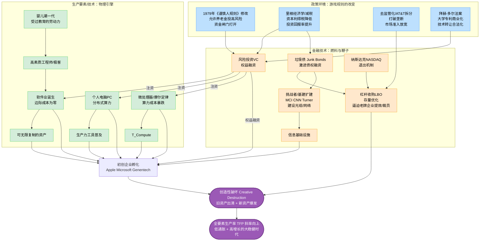

## 核心命题

技术革命单独不够，金融创新单独也不够。
80年代美国的爆发，是政策松绑、技术涌现、金融工具**三个齿轮同时咬合**的结果。
缺一个，创造性破坏不会发生。


## 机制全图


## 三阶段拆解（我 × Gemini 推演）

**第一阶段：体力劳动→通灵感应（1979-1982）**
- 《谨慎人规则》修改，养老金可以投VC，资金闸门打开
- 婴儿潮受教育劳动力大规模入场
- 信贷扩张，消费信用卡普及，内需引擎启动

**第二阶段：财运到——打通接续（1980-1984）**
- VC + 垃圾债双轮驱动：VC给新公司，垃圾债逼老公司
- LBO强迫存量企业提效裁员，释放资源给新经济
- Apple、Microsoft、Genentech在这个窗口孵化
- 纳斯达克提供退出机制，VC才敢进来

**第三阶段：引爆点——鱼群密度（1984-1986）**
- 网络效应触发，用户密度超过临界点
- MCI/CNN/Turner等挑战者用垃圾债融资建基础设施
- 光缆网络铺开，信息基础设施成型
- TFP斜率向上，大稳健时代开始

## 三个齿轮缺一不可

| 齿轮   | 作用                 | 缺失会怎样     |
| ---- | ------------------ | --------- |
| 政策松绑 | 打开资金闸门，让钱能流向风险资产   | 技术再好也拿不到钱 |
| 技术涌现 | 提供真实的生产力提升         | 金融只能炒泡沫   |
| 金融工具 | VC孵化新，垃圾债逼老，纳斯达克退出 | 创新无法规模化变现 |

## 对照2026年：哪个齿轮还没咬合
```
80年代齿轮             2026年对应                状态
─────────────────────────────────────────────────
《谨慎人规则》          稳定币立法 CLARITY Act    🔄 博弈中
VC资金闸门             AI投资潮                  ✅ 已在转
垃圾债/LBO             X Money/数字资产融资       🔄 建设中
纳斯达克退出            SpaceX IPO + 加密市场     🔄 即将到位
Apple/Microsoft        OpenAI/xAI/Anthropic      ✅ 已孵化
```

缺的那个齿轮：金融创新还没完全跟上技术创新。
一旦稳定币立法和AI公司上市路径打通，技术创新已经在等着了。

## 双向链接

[[2026年投资逻辑转变]]
[[历史周期类比：70-80年代转型期]]
[[技术革命与金融资本（佩雷斯）]]
[[X Money——马斯克的支付闸口]]
[[见证逆潮完整版(付鹏）]]
[[旧生产关系破坏规律]]