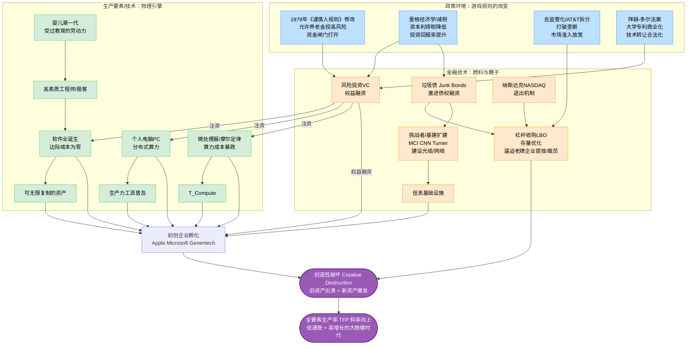

## 我的核心判断

技术革命和金融创新不是因果关系，是**一体两面**。
技术提供真实的生产力，金融提供规模化的燃料——
两者必须同步咬合，缺一个都不会触发TFP斜率的突变。

80年代美国是最清晰的历史样本。
2026年我们正在等待同样的咬合发生。
**X Money是我观察这次咬合是否发生的核心标的。**

## 80年代的咬合机制（付鹏原图）

## 三阶段节奏（我 × Gemini 推演）

**第一阶段：闸门打开（1979-1982）**
政策先动——《谨慎人规则》让养老金可以投风险资产，VC才有子弹。
技术还在实验室，金融先准备好了燃料。

**第二阶段：双轮咬合（1980-1984）**
VC孵化新公司，垃圾债逼老公司提效——两个方向同时发力。
新的在生长，旧的在出清，资源加速向新经济流动。
纳斯达克提供退出机制是关键——没有退出，VC不敢进来，闭环不成立。

**第三阶段：鱼群密度触发（1984-1986）**
用户密度超过临界点，网络效应自发触发。
MCI/CNN/Turner用垃圾债融资铺光缆——基础设施是金融工具建的，不是政府建的。
TFP斜率突变，大稳健时代开始。

## 2026年的对照：齿轮在哪里

| 80年代齿轮 | 2026年对应 | 状态 |
|----------|----------|------|
| 《谨慎人规则》修改 | 稳定币立法 CLARITY Act | 🔄 博弈中 |
| VC资金闸门 | AI投资潮 | ✅ 已在转 |
| 垃圾债/LBO | X Money+数字资产融资 | 🔄 建设中 |
| 纳斯达克退出机制 | SpaceX IPO + 加密市场 | 🔄 即将到位 |
| Apple/Microsoft孵化 | OpenAI/xAI/Anthropic | ✅ 已孵化 |
| 光缆/信息基础设施 | Starlink + 数据中心 | ✅ 已在建 |

**现在缺的是金融创新这条腿。**
技术侧已经就位，等的是金融侧的政策闸门打开。

## 为什么X Money是我的观察标的

80年代的金融创新有三件武器：VC、垃圾债、纳斯达克。
每一件都是为了让资本更高效地流向技术创新。

X Money要做的事在同一个位置：
- 把支付摩擦降到零——钱流动得越快，技术创新的资本循环越快
- 稳定币是AI Agent经济的底层结算——机器和机器之间的微支付，传统银行清结算根本跑不起来
- X平台的金融数据 + 支付行为数据 = 新一代信用体系的原材料

**X Money如果跑通，它扮演的角色相当于80年代的纳斯达克——不是技术本身，是让技术创新可以规模化变现的基础设施。**

## 我的观察指标

- CLARITY Act立法进展——稳定币合法化是金融闸门打开的信号
- X Money 6% APY能维持多久——撑住说明商业模式真实，降了说明是补贴
- X稳定币何时宣布——从支付工具升级为货币发行是质变
- SpaceX IPO招股书——第一次看到X/xAI的真实财务数据
- AI Agent微支付场景出现——M2M支付需求触发才是X Money真正的增长拐点

## 证伪条件

- 2027年底X Money用户存款规模仍不显著 → 支付场景没打开
- 稳定币立法持续受阻超过2年 → 金融创新这条腿跛了，本轮周期可能复制互联网泡沫而非80年代大稳健
- X稳定币迟迟不出现 → 马斯克的货币主权野心只是叙事

## 来源

- 图一（机制全图）：付鹏线下见面会现场分享（2026年，非公开发言）
- 图二（三阶段拆解）：我 × Gemini 推演，非付鹏原话
- 亲历感知：2011年网银→2026年X Money的代际变化

## 双向链接

[[X Money——马斯克的支付闸口]]
[[数字国家框架——OS生态即主权]]
[[2026年投资逻辑转变]]
[[历史周期类比：70-80年代转型期]]
[[技术革命与金融资本（佩雷斯）]]
[[见证逆潮完整版(付鹏）]]