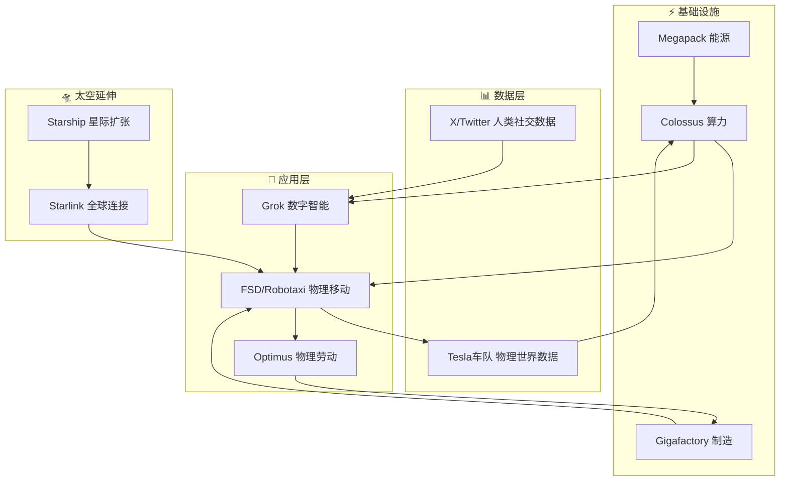

## 核心定位

⚠️ 叙事框架，不是已验证事实
用来理解战略意图，不用来做投资决策

## 飞轮全景图

## 五个飞轮现实状态

| 飞轮 | 逻辑 | 现实 |
|------|------|------|
| 数据-现实 | 车队采集→Dojo→OTA→更多数据 | ✅ 唯一已在转 |
| 能源-算力 | Megapack→Colossus→FSD | ⚠️ 闭环搭建中 |
| 软件复用 | FSD模型→移植Optimus | ⚠️ Optimus萌芽期 |
| 制造-劳动 | Optimus替代工厂→降成本 | ⚠️ 小规模测试 |
| 太空延伸 | Starlink→Robotaxi无死角 | ⚠️ 仍是叙事 |

## 关键推理

飞轮二（数据-现实）是基础
**FSD失败 = 整个Muskonomy逻辑基础崩塌**

用传统DCF给特斯拉估值会得出荒谬结论
——你在给飞轮系统用单业务模型定价

判断标准只有一个：
**飞轮里有没有真实数据或现金流在流动**
还是只是PPT上的箭头

目前：飞轮二有真实数据流动，其他四个是箭头

## 证伪条件

- FSD失败 → 飞轮二停转 → 系统失去基础
- Optimus遥遥无期 → 飞轮三四不启动
- 政治风险爆发 → 国家重划边界 → 飞轮五受限

## 双向链接

[[SpaceX = 新东印度公司]]
[[特斯拉FSD研究大纲]]
[[技术-商业成交模型]]
[[2026年投资逻辑转变]]
[[AI精炼矿+物理终端=合成劳动力]]
[[AI护城河——矿炼金厂模型]]
