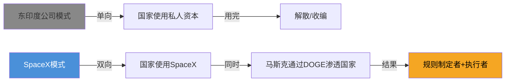

---
title: SpaceX = 新东印度公司
tags:
  - 马斯克
  - SpaceX
  - 地缘政治
aliases:
  - SpaceX地缘定位
  - 马斯克国家工具论
---

## 核心论点

SpaceX不只是一家火箭公司
**国家授权的私人资本扩张工具**
用私人效率干国家战略的事，风险国家兜底，收益私人拿

## 类比成立

东印度公司结构 → SpaceX对应：
- 国家授权 → NASA+军方合同
- 垄断特许 → 轨道资源先占
- 战略扩张 → Starlink=战场通信基础设施（乌克兰案例）

## 类比的边界

东印度公司1858年被国家解散——国家用完工具可以扔掉

SpaceX不同：马斯克通过DOGE**反向渗透**政府机器本身
权力结构是双向的，不是单向工具

## 更准确的类比

> 东印度公司 + 美联储的混合体
> 既是国家的工具，也在塑造规则本身

## 投资含义

- 核心风险不是商业失败，是**政治风险**
- 马斯克与华盛顿关系破裂是最大尾部风险
- 历史规律：国家最终会重新划定边界

## 双向链接

[[Muskonomy五个飞轮]]
[[第一性原理在追赶国为什么不起作用]]
[[2026年投资逻辑转变]]
[[我的偏见]]
[[AI护城河——矿炼金厂模型]]
