---
title: 特斯拉FSD研究大纲
tags:
  - 投资
  - 特斯拉
  - 自动驾驶
  - AI应用层
aliases:
  - Tesla FSD
  - Robotaxi
---

## 一、周期定位

### Gartner + 佩雷斯双框架
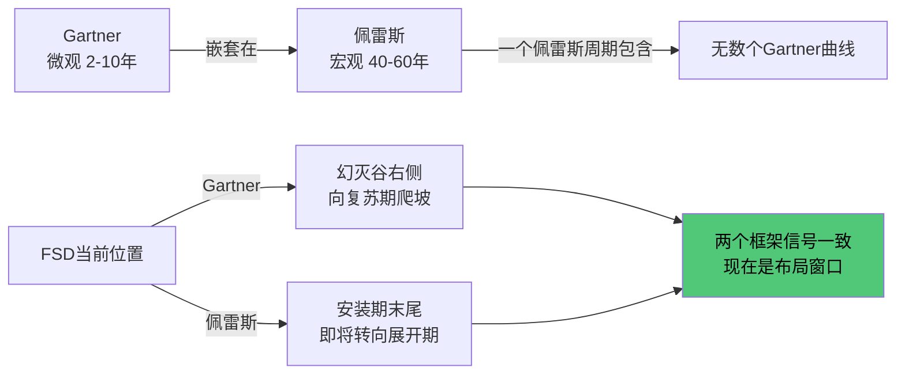

### FSD历史周期

| 阶段 | 时间 | 状态 | 典型特征 |
|------|------|------|----------|
| 震荡期 | 2016-2018 | HW2.0上市 | 开始卖FSD选装包 |
| 泡沫期 | 2019-2021 | Autonomy Day | 100万辆Robotaxi承诺，PE破千倍 |
| 幻灭期 | 2022-2024 | Karpathy离职 | NHTSA调查，降价打脸，代码重写 |
| **复苏爬坡** | **2025-今** | **V12端到端** | **飞轮启动，里程指数增长** |

### FSD vs Waymo对比

| 维度 | Tesla FSD | Waymo |
|------|-----------|-------|
| Gartner位置 | 幻灭谷右侧爬坡 | 复苏期（地理围栏内已无人） |
| 策略 | 泛化——任何地方都跑 | 限定——地理围栏 |
| 瓶颈 | Corner Cases | 扩规模成本极高 |
| 现状 | 用户还在兜底，但每天数百万辆跑数据 | 体验好但多数人叫不到 |

---

## 二、FSD里程碑数据

### J曲线三阶段
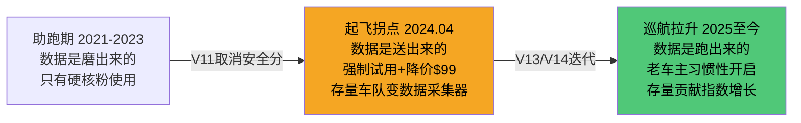

### 里程碑时间轴

| 时间 | 累计里程 | 关键事件 |
|------|----------|----------|
| 2021-2023 | <5亿英里 | 平缓期 |
| 2023 Q4 | 7-8亿英里 | V11取消安全分限制 |
| 2024.04 | 10亿英里 | **历史性拐点** |
| 2024.06 | 16亿英里 | 两个月+60% |
| 2025.03 | 36亿英里 | 垂直拉升 |
| 2025.12 | ~70亿英里 | 飞轮全速 |
| **目标** | **100亿英里** | **无监督FSD安全验证红线** |

60亿英里 = 监管批准Robotaxi基础门槛
100亿英里 = 实现无监督自动驾驶的安全验证红线

---

## 三、商业模式

### 核心定位
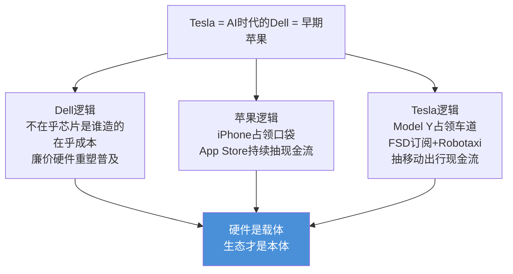

### 刮胡刀与刀片模型
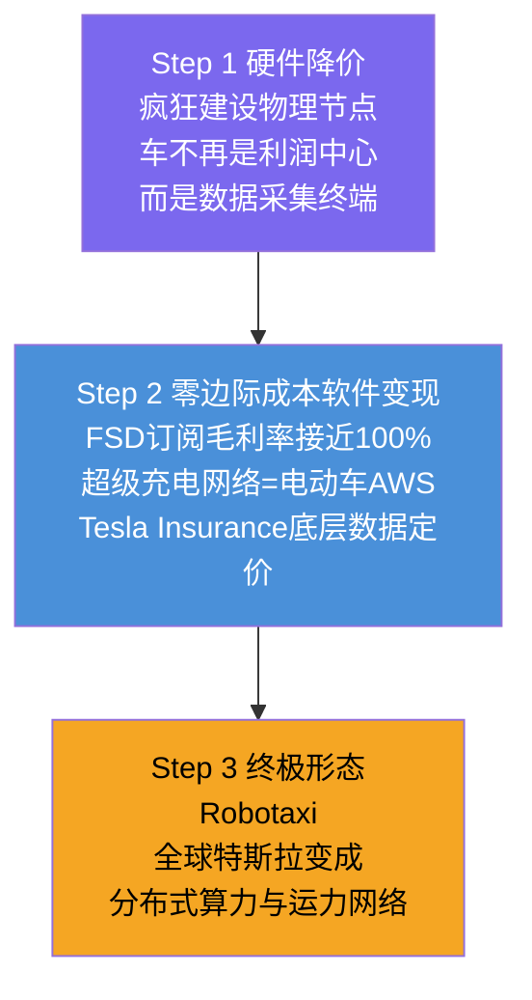

### 钱生钱闭环
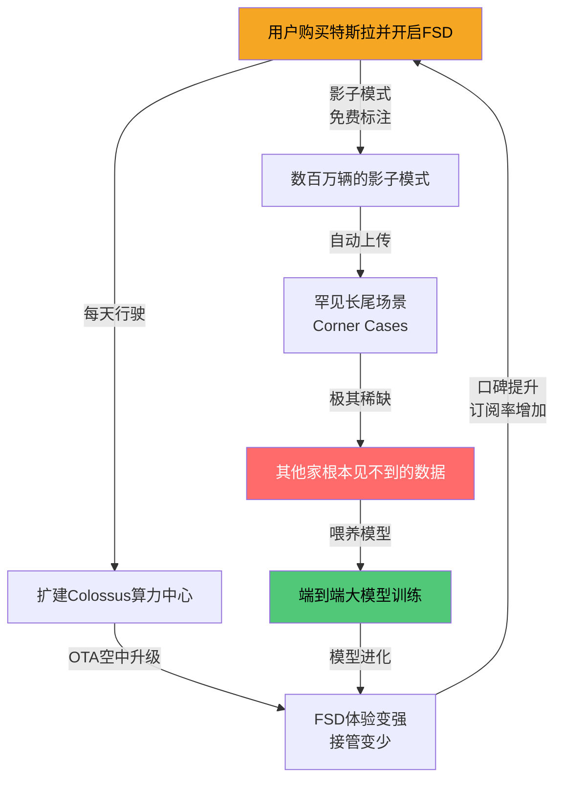

### 传统OEM三重死锁
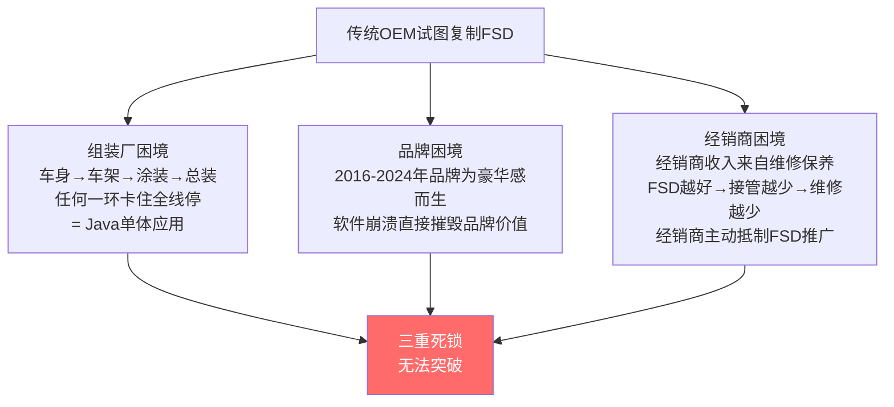

---

## 四、护城河：数据引力黑洞

### 数据飞轮
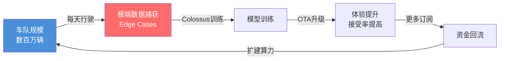

### 后来者两条路均死局
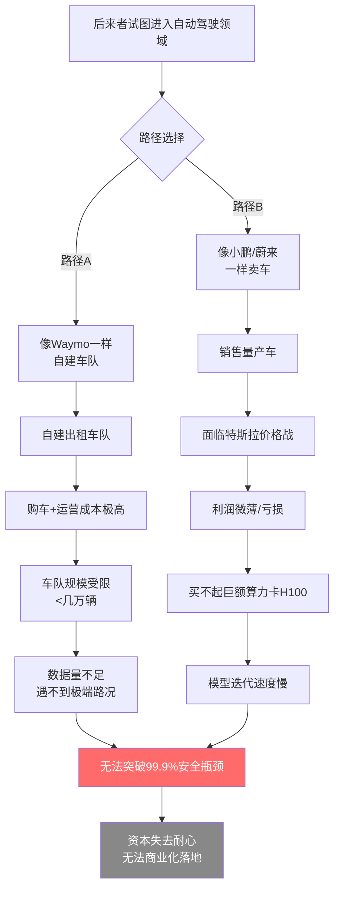

### FSD vs Starlink：同一种暴力美学

| 维度 | Starlink | FSD |
|------|----------|-----|
| 覆盖目标 | 物理空间：地球表面每一寸土地 | 概率空间：驾驶中每一种场景排列组合 |
| 单体战术 | 廉价卫星，不追求NASA标准 | 影子模式，不追求专业Waymo试驾 |
| 策略关键 | 占轨道，后者无轨可占 | 占数据，后者无长尾可采 |
| 核心逻辑 | 用规模换确定性 | 用规模换确定性 |

### AI性能对数增长的绝望
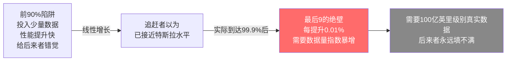

---

## 五、技术架构

### 端到端神经网络的本质
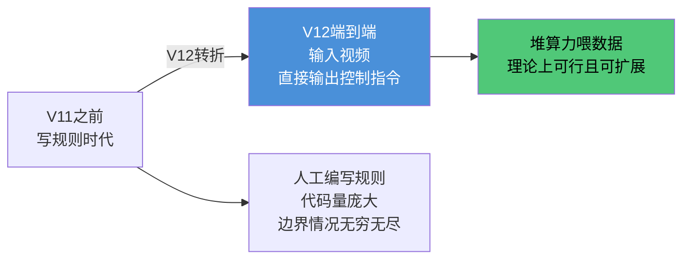

### 真正走出低谷的两个硬条件
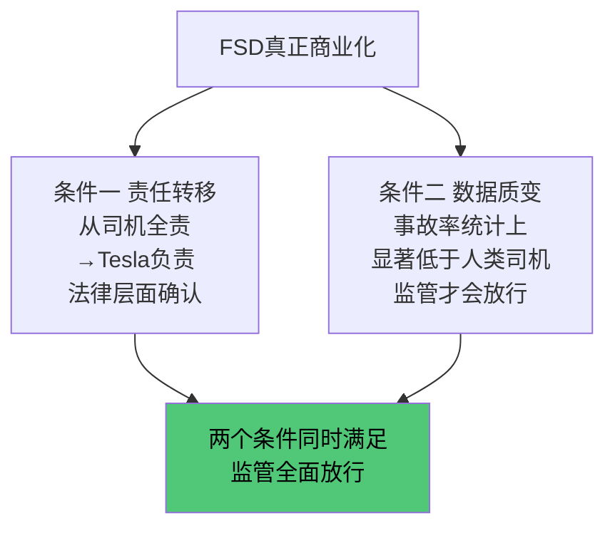

---

## 六、宏观环境

### 特朗普2.0三个开绿灯管道
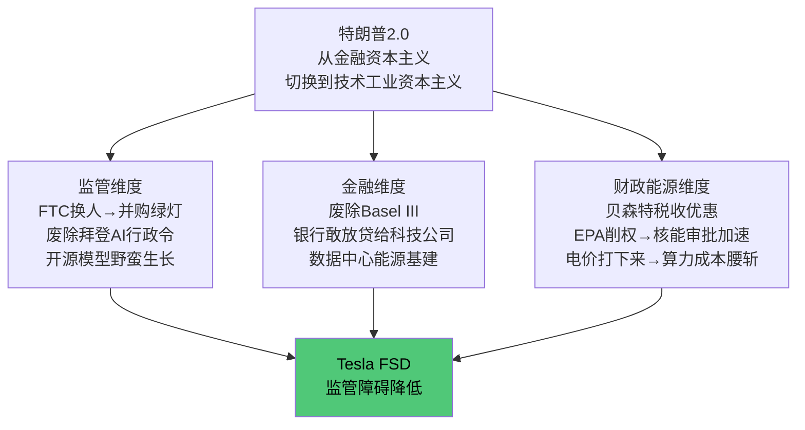

### Unboxed Process = Build Success信号
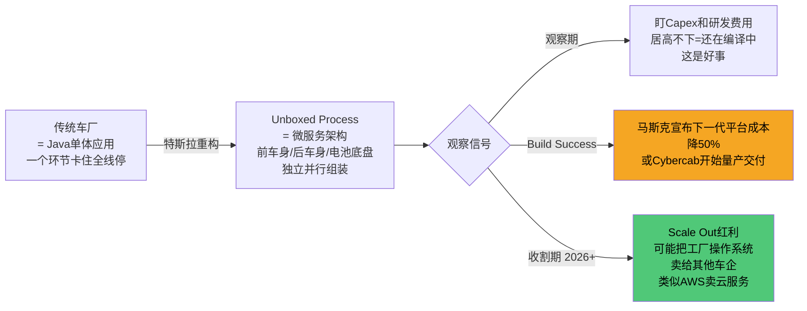

---

## 七、投资判断

### 供需成交分析
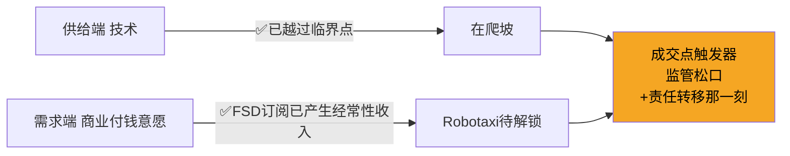

### 观察信号

**买入信号：**
- 监管批准无监督运营（责任转移）
- 马斯克宣布下一代平台成本降50%
- Cybercab开始量产交付

**证伪信号：**
- FSD事故率无法统计上低于人类司机
- 竞争对手在Corner Cases上追上来
- 马斯克注意力彻底转移离开特斯拉

### 风险项权重

| 风险 | 权重 | 说明 |
|------|------|------|
| 监管时间线慢于预期 | 🔴高 | 保险/州法闭环复杂 |
| Waymo地理围栏先行吸引资本 | 🔴高 | 已在旧金山商业验证 |
| 算力成本打不下来 | 🟠中 | Dojo/Terafab进度 |
| 品牌受损 | 🟡低 | 已被市场消化 |
| 马斯克注意力分散 | 🟡低 | 仍在强推FSD |

---

## 八、待验证假设

| 假设 | 来源 | 验证方法 |
|------|------|----------|
| ⚠️ 2026年上半年突破100亿英里 | 斜率推算非官方 | 跟踪Tesla官网里程数据 |
| ⚠️ 全球出行TAM 1000亿美元 | Gemini给的无可靠来源 | 打折处理方向可能对 |
| ⚠️ Muskonomy五个飞轮协同 | 逻辑成立速度是假设 | 等Optimus量产数据 |
| ⚠️ 特朗普开绿灯传导路径 | 方向可能对落地待观察 | 跟踪Basel III/核能进展 |
| ⚠️ Tesla=苹果/Dell类比 | 性感但不是论据 | 看FSD订阅收入占比 |

---

## 双向链接

[[技术-商业成交模型]]
[[AI商业验证的筛选标准]]
[[2026年投资逻辑转变]]
[[技术革命与金融资本（佩雷斯）]]
[[Muskonomy五个飞轮]]
[[SpaceX = 新东印度公司]]
[[AI产业链总览]]