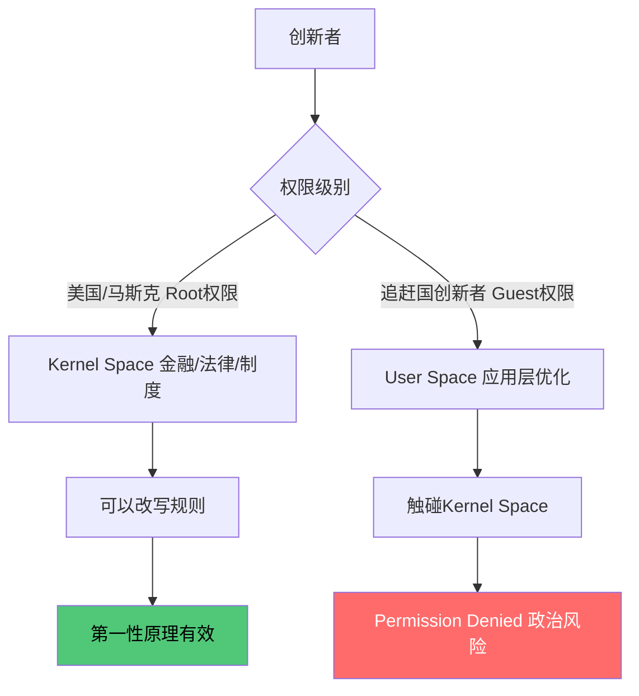
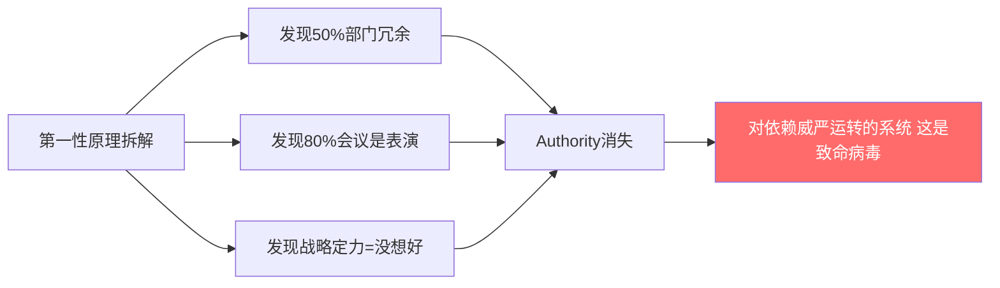

---
title: 第一性原理在追赶国为什么不起作用
tags:
  - 制度
  - 框架分析
  - 地缘政治
aliases:
  - 第一性原理局限性
  - 追赶国制度困境
---

## 核心论点

第一性原理不承认"祖宗之法"，只承认数据、逻辑、物理定律
- 开放系统里：引擎
- 封闭系统里：炸药

## Root权限 vs Guest权限

## 第一性原理的杀伤力

## 三个前提条件

马斯克能用第一性原理，因为同时满足：
1. 制度有自我修正机制（司法独立）
2. 失败成本可承受（破产保护）
3. 资本愿意为不确定性付费（VC文化）

追赶国通常三个都不完整

## 历史参照

- 朱镕基改革 = 体制内用接近第一性原理的方式强行重构
- 里根改革 = 用意识形态包装第一性原理绕过政治阻力
- 两者都是**体制内操作**，不是体制外颠覆

## 投资含义

追赶国找机会：不找颠覆者，找**体制内改革受益者**
Alpha在：谁能在Guest权限下找到Root权限的缝隙

## 双向链接

[[SpaceX = 新东印度公司]]
[[2026年投资逻辑转变]]
[[生产力-生产关系-世界秩序]]
[[我的偏见]]