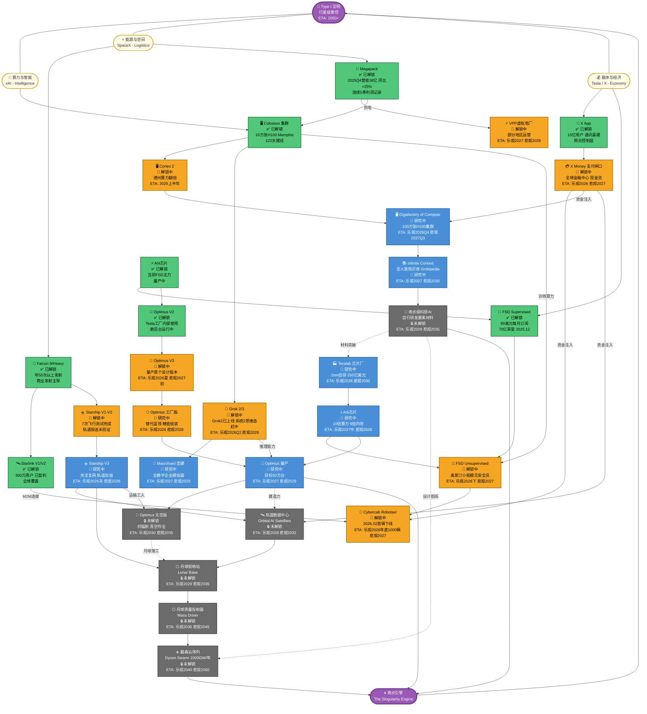

## 一句话理解

马斯克在同时玩三局游戏：用算力和智能构建大脑，用能源和空间构建躯体，用载体和经济构建血液——三局游戏的终局是同一个目标：Type I文明。

## 图例

| 颜色 | 状态 |
|------|------|
| 🟢 绿色 | ✅ 已解锁——有真实收入或商业化运营 |
| 🟠 橙色 | 🔄 解锁中——技术可用但商业化未完成 |
| 🔵 蓝色 | 🔬 研究中——有原型但离商业化还远 |
| ⚫ 灰色 | 🔒 未解锁——还是蓝图阶段 |
| 🟣 紫色 | 🌀 里程碑节点 |

## 科技树

## 追踪说明

节点状态升级路径：`🔒 未解锁` → `🔬 研究中` → `🔄 解锁中` → `✅ 已解锁`

有新进展直接改对应节点的状态标注和ETA，不用重写整张卡片。

## 双向链接

[[Muskonomy五个飞轮]]
[[特斯拉FSD研究大纲]]
[[SpaceX = 新东印度公司]]
[[AI精炼矿+物理终端=合成劳动力]]
[[2026年投资逻辑转变]]